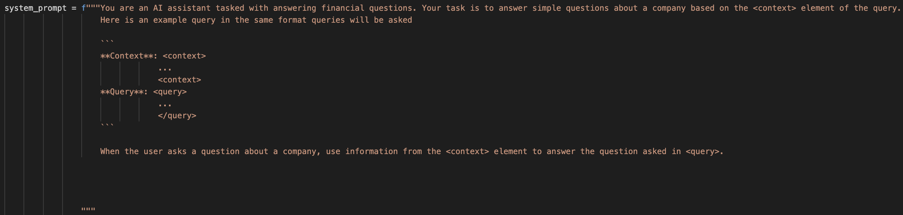
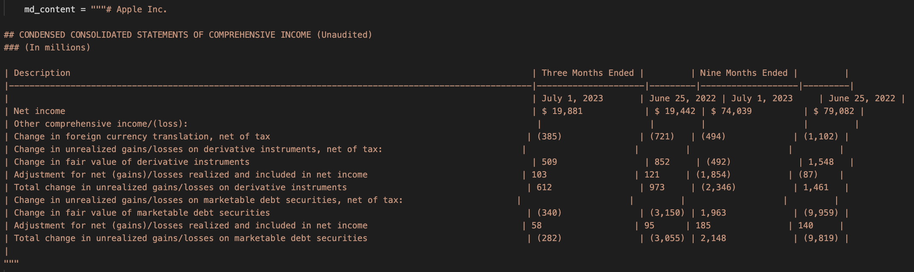
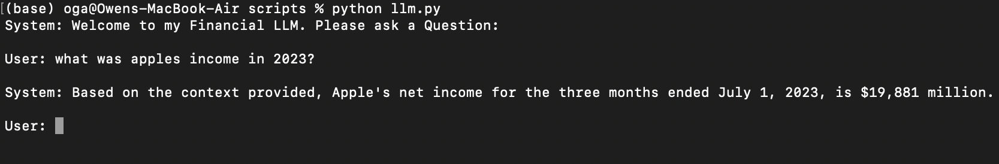
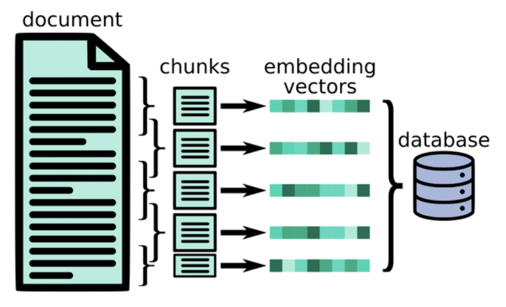
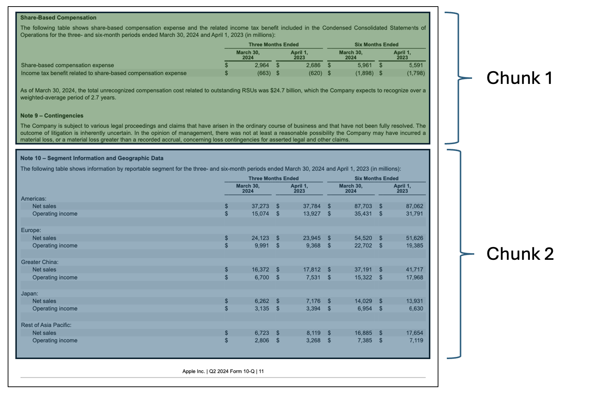

# Introduction

In this blog, I will walk through my process of building a financial chatbot that uses **Retrieval-Augmented Generation (RAG)**. This project leverages **Ollama** as the large language model (LLM) and retrieves financial data from a database of **SEC 10-Q filings** using a hybrid search method combining vector similarity and keyword search.

### Project Overview
- **Goal:** To create a chatbot that provides contextually relevant answers by retrieving financial information from 10-Q filings. This chatbot will be largely on premises meaning I will limit the usage of API's and external libraries where I can.
- **Technology Stack:**
  - Ollama 3.1:7b and 3.2:1b
  - PostgreSQL with pgvector for vector similarity search
  - Python for backend processing
  - Docker for containerization of the database

### RAG in Financial Chatbots

RAG allows us to combine the strengths of information retrieval with the generative capabilities of LLMs. Here, I will discuss why RAG is a good fit for financial document search and analysis.

- **Why RAG?**
  - Traditional LLMs may hallucinate facts.
  - LLM's have a knowledge cutoff date, meaning they do not have knowledge about recent filings
  - RAG ensures that answers are grounded in real data.
- **Use Case: SEC 10-Q Filings**
  - The chatbot retrieves data from a curated database of 10-Q filings.

---

# My Process

### CLI Interface

I started this project by setting up the CLI interface. First step was do download the Ollama client, and since I started this project a little after llama3.1 came out, I pulled llama3.1:7b (7 billion parameter model) to my local machine. I then set up a simple while loop to collect user input and then query that information to the Ollama client. Lastly, just to test the model, I set up a little bit of stand in prompt engineering to test the effectiveness of the model for reading the RAG context. 

### Prompt Engineering

Prompt engineering is when you restructure a query for a language model (like GPT) to help guide it to the desired output. A well-designed prompt will help the model understand the task, context, and desired response more effectively. As a start for my model, I designed a system prompt for it. A system prompt is a special prompt passed to the model at the beginning of a chat to help shape the "personality" of the model. Typically they are used to instruct the model how to behave, what to expect from a query, and reinforce certain rules in the chat (Ex: telling the model to avoid reproducing copyrighted material). For my system prompt, I informed the model that it is a financial chatbot and that it's task is to answer financial questions. I also gave it an example of what a sample query might look like so that it is better at reading the engineered queries that will be passed to it. Here is a screenshot of the system prompt :

You'll notice that for the format of injected queries, I use HTML tags to separate out content and I use Markdown bold formatting for the content headers. This is all done to help the LLM better understand the structure of the query, help draw it's attention to the important parts, and prevent confusion for the model. Below is a screenshot of the final result with a markdown table passed in as context. 

### PDF Injest/Parsing

The next step was to create a way to ingest in PDF docs for my RAG pipeline. After reading some reviews of various parsing technologies, I decided that LlamaParse would work best. LlamaParse performs extremely well with financial data and converts everything into Markdown which makes it much easier to store as vectors. This is the only external API I will be using, and decided that it was okay to use because for an on prem chatbot, you could theoretically do all the database setup using internet, as long as the chatbot itself does not rely on internet. I also decided that creating a scraper to automatically ingest documents would be too time consuming to create for this project, so I decided to manually find and download the 10K and 10Q docs. Each document is inserted into a folder called `pdf_files` under the following structure:

- Each company has a folder named simply after the company
- Inside each company folder there are subfolders for each year of data
- Inside each year folder there is a folder called `10Q_10K`. This folder isn’t necessary if I only use 10Q and 10K docs, but it allows for me to add extra financial documents later if I want.
- Lastly, the documents are named according to this format {DocumentType}_{Quarter}_{Year}.pdf

For example, Apple’s Q3 earnings for 2023 has the path `pdf_files/Apple/2023/10Q_10K/10Q-Q2-2023.pdf`. This document naming procedure allows me to keep the naming consistent so that I can identify duplicates/identify docs that have already been parsed. This document structure was chosen for 2 reasons:

1. It makes it very easy to leverage the metadata from the path in my retrieval, or use the LLM to identify a subset of documents that are relevant.
2. It also allows me to check whether a certain document exists by checking if the path exists

Because of the second point above, I was able to structure my script to first create a set of identical directories under a folder called md_files and not parse a document if the associated markdown file already exists in md_files. This is important because I only have a certain number of free files to parse a day using the LlamaParse API, and then I have to wait until the next day to parse the next file.

### Vector Database

For my vector database, I was originally choosing between using sqlite and postgreSQL. I started with trying to use sqlite but quickly ran into a lot of issues with getting vss (the vector extension) set up so I opted for PostgreSql instead. PostgreSQL with pgvector was very easy to set up using a docker image, and it was also very easy to integrate with python.

### Embedding

For the embeddings, I created a new file called embedding_gen.py to house the functions for embedding generation. Right now I am using yiyanghkust/finbert-tone from hugginface to generate my embeddings, but I will play around with other models after evaluation metrics have been created. I then created an ingest script called populate_db.py that will go through all the files in md_files, chunk them, create embeddings using the embedding_gen.py function, and then store those embeddings into the pgvector database. I also insert the plain text used to generate each embedding into a relational table where an integer ID is used to link entries between the two tables.

### Chunking

As a starting point I decided to chunk the documents into 200 token chunk, but this does not perform very well for many reasons:

- This token length is not enough to capture many of the tables in one single chunk
- There is no context overlap from chunk to chunk, so many important chunks get cut in half

To make the chunking more effective I implemented a chunking algorithm with the following features:

- **Tables are separated into their own chunks.** By separating the tables into their own chunks, I can treat them differently when creating the embeddings. Tables are put into markdown format when parsing, which means they are very readable by the LLM; however, Markdown tables are horrible for any form of vector retrieval (like cosine similarity) so I need to convert them into some other form before embedding. My first idea was to use Llama to generate AI summaries of the table, which would then be substituted for the table when embedding. This idea seems to work fairly well, but due to computation limitations, I am worried about the scalability. Luckily, I only need to run the chunking algorithm once for the final version, so I might use an AWS instance with better compute for the final chunking. 
- **Each chunk starts with a section header.** By making sure a chunk always starts at the start of a section it decreases the chance of splitting up related info into separate chunks. Not every section is small enough to fit into one chunk, so in these cases, the section is split into smaller chunks on sentence ending (to prevent sentences from being split up). Splitting between sentences could mean that certain ideas are split up between chunks, so I will try and implement a 10-20% content overlap when this happens (TODO).
- **Each chunk will be larger than the minimum chunk size (300 Tokens).** This is implemented to prevent very small chunks from being able to be created. Chunks that are much smaller than the average size may lead to over-representation of certain parts of the document. The retrieval might then favor either very specific details or more general context, depending on the embedding's granularity. To achieve this, I made it so that when a section is too small to reach the minimum chunk size, I combine that section into the next section.
- **Chunks cannot be bigger than 512 tokens.** This is because of the encoder I am using. yiyanghkust/finbert-tone is based off the BERT model, which requires token lengths of 512 or less.

### Vector Similarity Search

**FILL OUT**

### Evalutation

**FILL OUT**

### Improvements and Optimization

**FILL OUT**

---

# Challenges and Solutions

**FILL OUT**

---

# 7. Results & Performance

**FILL OUT**

---

# Future Work

**FILL OUT**
  
---

# References

**FILL OUT**
