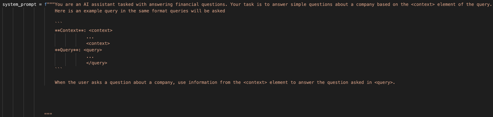

# Introduction

In this blog, I will walk through my process of building a financial chatbot that uses **Retrieval-Augmented Generation (RAG)**. This project leverages **Ollama** as the large language model (LLM) and retrieves financial data from a database of **SEC 10-Q filings** using a hybrid search method combining vector similarity and keyword search.

## Project Overview
- **Goal:** To create a chatbot that provides contextually relevant answers by retrieving financial information from 10-Q filings. This chatbot will be largely on premises meaning I will limit the usage of API's and external libraries where I can.
- **Technology Stack:**
  - Ollama 3.1:7b and 3.2:1b [^2]
  - PostgreSQL with pgvector for vector similarity search [^3]
  - Python for backend processing
  - Docker for containerization of the database

## RAG in Financial Chatbots

RAG allows us to combine the strengths of information retrieval with the generative capabilities of LLMs. Here, I will discuss why RAG is a good fit for financial document search and analysis.

- **Why RAG?**
  - Traditional LLMs may hallucinate facts. 
  - LLM's have a knowledge cutoff date, meaning they do not have knowledge about recent filings
  - RAG ensures that answers are grounded in real data. [^1]
- **Use Case: SEC 10-Q Filings**
  - The chatbot retrieves data from a curated database of 10-Q filings.

---

# My Process

## CLI Interface

I started this project by setting up the CLI interface. First step was do download the Ollama client, and since I started this project a little after llama3.1 came out, I pulled llama3.1:7b (7 billion parameter model) to my local machine. I then set up a simple while loop to collect user input and then query that information to the Ollama client. Lastly, just to test the model, I set up a little bit of stand in prompt engineering to test the effectiveness of the model for reading the RAG context. 

## Prompt Engineering

Prompt engineering is when you restructure a query for a language model (like GPT) to help guide it to the desired output. A well-designed prompt will help the model understand the task, context, and desired response more effectively [^4]. As a start for my model, I designed a system prompt for it. A system prompt is a special prompt passed to the model at the beginning of a chat to help shape the "personality" of the model. Typically they are used to instruct the model how to behave, what to expect from a query, and reinforce certain rules in the chat (Ex: telling the model to avoid reproducing copyrighted material). For my system prompt, I informed the model that it is a financial chatbot and that it's task is to answer financial questions. I also gave it an example of what a sample query might look like so that it is better at reading the engineered queries that will be passed to it. Here is a screenshot of the system prompt :



You'll notice that for the format of injected queries, I use HTML tags to separate out content and I use Markdown bold formatting for the content headers. This is all done to help the LLM better understand the structure of the query, help draw it's attention to the important parts, and prevent confusion for the model. Below is a screenshot of the final result with a markdown table passed in as context. 


## PDF Injest/Parsing

The next step was to create a way to ingest in PDF docs for my RAG pipeline. After reading some reviews of various parsing technologies, I decided that LlamaParse would work best. LlamaParse performs extremely well with financial data and converts everything into Markdown which makes it much easier to store as vectors. This is the only external API I will be using, and decided that it was okay to use because for an on prem chatbot, you could theoretically do all the database setup using internet, as long as the chatbot itself does not rely on internet. I also decided that creating a scraper to automatically ingest documents would be too time consuming to create for this project, so I decided to manually find and download the 10K and 10Q docs. Each document is inserted into a folder called `pdf_files` under the following structure:

- Each company has a folder named simply after the company
- Inside each company folder there are subfolders for each year of data
- Inside each year folder there is a folder called `10Q_10K`. This folder isn’t necessary if I only use 10Q and 10K docs, but it allows for me to add extra financial documents later if I want.
- Lastly, the documents are named according to this format {DocumentType}_{Quarter}_{Year}.pdf

For example, Apple’s Q3 earnings for 2023 has the path `pdf_files/Apple/2023/10Q_10K/10Q-Q2-2023.pdf`. This document naming procedure allows me to keep the naming consistent so that I can identify duplicates/identify docs that have already been parsed. This document structure was chosen for 2 reasons:

1. It makes it very easy to leverage the metadata from the path in my retrieval, or use the LLM to identify a subset of documents that are relevant.
2. It also allows me to check whether a certain document exists by checking if the path exists

Because of the second point above, I was able to structure my script to first create a set of identical directories under a folder called md_files and not parse a document if the associated markdown file already exists in md_files. This is important because I only have a certain number of free files to parse a day using the LlamaParse API, and then I have to wait until the next day to parse the next file.

## Database

For my vector database, I was originally choosing between using sqlite and postgreSQL. I started with trying to use sqlite but quickly ran into a lot of issues with getting vss (the vector extension) set up so I opted for PostgreSql instead. PostgreSQL with pgvector was very easy to set up using a docker image, and it was also very easy to integrate with python.

My database has a vector table called embedding_chunks which contains the embeddings for each chunk and the associated year, company, quarter, and document type associated with that chunk. Here is the `\d embedding_chunks` output, which describes the schema of the table: 
```
                                        Table "public.embedding_chunks"
     Column     |          Type          | Collation | Nullable |                   Default                    
----------------+------------------------+-----------+----------+----------------------------------------------
 id             | bigint                 |           | not null | nextval('embedding_chunks_id_seq'::regclass)
 embedding      | vector(768)            |           |          | 
 company        | text                   |           |          | 
 year           | character varying(4)   |           |          | 
 document_type  | character varying(255) |           |          | 
 fiscal_quarter | character varying(2)   |           |          | 
Indexes:
    "embedding_chunks_pkey" PRIMARY KEY, btree (id)
```
My database also contains a relational table called text_chunks which contains the raw text for each chunk and the associated year, company, quarter, and document type associated with that chunk. The id column in the text_chunks table is a primary key, and forms a foreign key with the embedding_chunks table. This means that whenever I need the raw text for a certain embedding, I can just consult this relational table. Here is the `\d text_chunks` output, which describes the schema of the table: 
```
                        Table "public.text_chunks"
     Column     |          Type          | Collation | Nullable | Default 
----------------+------------------------+-----------+----------+---------
 id             | bigint                 |           | not null | 
 text           | text                   |           |          | 
 company        | text                   |           |          | 
 year           | character varying(4)   |           |          | 
 document_type  | character varying(255) |           |          | 
 fiscal_quarter | character varying(2)   |           |          | 
Indexes:
    "text_chunks_pkey" PRIMARY KEY, btree (id)
```
As previously mentioned, the files are stored in a nexted directory structure such that the path of each document gives metadata about the fiscal year, company, document type, and fiscal quarter of each document. This is how we get this information when we are populating the database. 

## Embedding

For the embeddings, I created a new file called embedding_gen.py to house the functions for embedding generation. Right now I am using yiyanghkust/finbert-tone from hugginface to generate my embeddings, but I will play around with other models after evaluation metrics have been created. I then created an ingest script called populate_db.py that will go through all the files in md_files, chunk them, create embeddings using the embedding_gen.py function, and then store those embeddings into the pgvector database. I also insert the plain text used to generate each embedding into a relational table where an integer ID is used to link entries between the two tables.


## Chunking

As a starting point I decided to chunk the documents into 200 token chunk, but this does not perform very well for many reasons:

- This token length is not enough to capture many of the tables in one single chunk
- There is no context overlap from chunk to chunk, so many important chunks get cut in half

To make the chunking more effective I implemented a chunking algorithm with the following features:

- **Tables are separated into their own chunks.** By separating the tables into their own chunks, I can treat them differently when creating the embeddings. Tables are put into markdown format when parsing, which means they are very readable by the LLM; however, Markdown tables are horrible for any form of vector retrieval (like cosine similarity) so I need to convert them into some other form before embedding. My first idea was to use Llama to generate AI summaries of the table, which would then be substituted for the table when embedding. This idea seems to work fairly well, but due to computation limitations, I am worried about the scalability. Luckily, I only need to run the chunking algorithm once for the final version, so I might use an AWS instance with better compute for the final chunking. 
- **Each chunk starts with a section header.** By making sure a chunk always starts at the start of a section it decreases the chance of splitting up related info into separate chunks. Not every section is small enough to fit into one chunk, so in these cases, the section is split into smaller chunks on sentence ending (to prevent sentences from being split up). Splitting between sentences could mean that certain ideas are split up between chunks, so I will try and implement a 10-20% content overlap when this happens (TODO).
- **Each chunk will be larger than the minimum chunk size (300 Tokens).** This is implemented to prevent very small chunks from being able to be created. Chunks that are much smaller than the average size may lead to over-representation of certain parts of the document. The retrieval might then favor either very specific details or more general context, depending on the embedding's granularity. To achieve this, I made it so that when a section is too small to reach the minimum chunk size, I combine that section into the next section.
- **Chunks cannot be bigger than 512 tokens.** This is because of the encoder I am using. yiyanghkust/finbert-tone is based off the BERT model, which requires token lengths of 512 or less.


## Database Search

Now that I have set up the vector database, the next step is to decide on how I am going to perform my database search. In a RAG pipeline, you will have a vector database populated with vectors in the form of embeddings generated from your text corpus. You then have to figure out a way to search that database to retrieve information related to the users query. My database search can be broken down into two key steps:

1. Filter Extraction 

2. Vector Similarity Search

### Filter Extraction

One early issue that I encountered with retrieval was making sure that the right document is being returned, rather than similar content from an unintended document. For example, say I am asking about Apple's debt in 2023. Language describing debt is common in any 10Q/10K file, and so it is likely to return that content from a 10Q/10K file from a different year, or even a different company. 

To make my searching much more accurate, I decided it would be worth extracting out the relevant companies, years, and quarters from the user's query to use as filters before performing Vector Similarity Search. The first step is to query the same LLM (llama3.1:7b) used for user conversation, and ask it to extract the years and companies related to the query into a list format. Below is an example of what this might look like:

**User Query:**
```
User: How much debt did tesla have in 2024?
```
**LLM Response:**
```
Based on your prompt, here are the companies and years extracted from the user's query:

**Companies** = ['Tesla']
**Years** = [2024]
**Quarters** = [2024]
```
The LLM will always give the two lists in the same format, so I can easily parse and extract the three lists using a simple regex expression. After this parsing step, I will have three variables, one containing the list of related companies, the other the list of related years, and the last containing a list of related quarters (if any). 

As you remember earlier, the vector database contains columns for companies, years, and quarters that were extracted from the local document file structure. I can use the lists of information extracted from the users prompt to then perform a SQL query that will return only the relevant vectors for the users query based on company, year, and quarter (when applicable). This will greatly improve retrieval accuracy by preventing chunks from unrelated documents from sneaking into the top_n chunks retrieved. 

### Vector Similarity Search
After retrieving the filtered vectors, the RAG pipeline will then use Vector Similarity Search to find the entries that are closest to the query the user asks. There are many forms of Vector Similarity search:

1. Exact Nearest Neighbors (Brute Force Search): This algorithm computes the distance between a query vector and all vectors in the dataset, ranking them by similarity. Although precise, brute-force search becomes computationally expensive with larger datasets, making it less practical for real-time applications unless optimized with GPU acceleration or indexing.

2. Approximate Nearest Neighbors (ANN) Algorithms: ANN algorithms aim to find nearest neighbors faster than brute-force by approximating results. They include:

    - HNSW (Hierarchical Navigable Small World): A graph-based algorithm that builds a multi-layered proximity graph to connect similar points, allowing for fast traversal and search. HNSW is popular for high-speed, high-accuracy approximate searches in large datasets.

    - FAISS (Facebook AI Similarity Search): Developed by Meta, FAISS includes various indexing methods (e.g., IVF, PQ) for efficient ANN searches on large datasets. FAISS is highly optimized and performs well on GPUs, making it suitable for large-scale RAG systems.

    - Annoy (Approximate Nearest Neighbors Oh Yeah): Annoy creates binary trees to partition data, which makes it fast for read-heavy, large-scale applications, though it sacrifices some accuracy compared to other algorithms.

3. Product Quantization (PQ): PQ compresses vectors by segmenting and encoding them into lower dimensions, then applies an inverted index for fast searching. While it reduces storage and speeds up similarity searches, PQ may reduce precision, so it’s often used in combination with other methods like FAISS.

There are many more algorithms than just these three, but I will not go into them for the sake of keeping it brief. Since my dataset will be very small, as this is just a POC, I will be opting for the Exact Nearest Neighbors brute force method. This is because it will give me the highest accuracy out of the options provided, and I shouldn't need to worry about computation costs or performance. 

Exact nearest neighbors (and many of the other search algorithms) need a similarity function to be able to calculate similarity between the embedding generated from the users query and the embeddings in the database. A couple of common similarity functions are Cosine Similarity, Euclidean Distance, Manhattan Distance (L1 Distance), Dot Product (Inner Product), and Hamming Distance. I will not go into detail on these, as many are unrelated to vector embedding similarity. Cosine Similarity and Dot Product Similarity are the only two that are typically used with embeddings, and we will be going with Cosine Similarity since it is generally better and Dot Product Similarity requires the embeddings to be normalized. 

Steps 1 and 2 of the database search are actually implemented in my code as a simple SQL query. Step 1 takes the form of a SELECT statement using a WHERE clause to filter by company, year, and fiscal quarter. Step 2 is achieved by then using an ORDER BY clause on the resulting SELECT statement to order the results by cosine similarity to the user query embedding, where the most similar results are displayed first. 

## RAG Pipeline

The RAG pipeline from a very high level consists of the following steps (I would like to note that this is a very high level description, and there are a lot more nuances that go into setting up a RAG pipeline):

1) Grab user input

2) Create embedding from user query

3) Perform Vector Similarity Search on DB (as described in the previous section)

4) Take the Chunks returned from step 3 and insert it as context into the original query 

5) Take the context-enhanced query and pass it to the LLM as part as the user's conversation


## Evalutation

Evaluating a RAG pipeline is a hard and tedious task, that has many possible routes to take, but no one best technique or strategy. Much of it is trial and error, and so this can take a lot of time and energy. I wanted to start my evaluation pipeline by using some form of context relevance algorithm to give measurable metrics on the performance of my RAG. The reason I went this route is because context relevance algorithms typically are the best way to provide some number that measures the performance of my RAG, which will give undeniable proof of improvement or deterioration of my Retrieval when tuning. This is very similar reasoning to why we use metrics like f1, precision, and recall as a performance metric in standard machine learning tasks. 

#### Evaluation Dataset

Before diving into performance metrics, I need a dataset to run these metrics against. The metrics that I will focus on require me to have a dataset containing sample queries the user might ask, and the associated context from the document database that should be retrieved based on that query. A query could have any number of relevant documents returned, so for this reason, I will be using a JSON datastructure to store the evaluation dataset. 

The first step in developing this dataset is to gather a list of queries that the user might ask. I wanted to start with about 100 queries, since I would have to build this dataset manually, so even 100 rows would take a considerable amount of time to create. 

#### Retreival Evaluation Metrics

There are a lot of different performance metrics that one can use for RAG when evaluating, and they fall into many different categories. All of the different metrics can be identified as one of two types: 1) Binary Relevance Metrics and 2) Graded Relevance Metrics. Binary relevance metrics will work off the assumption that a retrieved document is either "relevant" or "irrelevant", basically categorizing the retrieved documents into black and white classes; however, Graded Relevance Metrics instead aim to identify “shades” of relevance as opposed to black and white “is relevant” and “is not relevant”. For the purpose of this project, I will start by focusing on binary relevance, as it is a lot more simple to implement, and a lot more applicable in my use case (if I ask for earnings of a company, the returned chunks either answer the question or don't. There is no in-between.)

Binary Relevance Metrics can be broken down further into two sub-categories: 1) Order Unaware and 2) Order Aware. These two categories are fairly self explanatory, where order unaware will grade based on the total number or relevant documents returned regardless of order, whereas order aware will give better grades when relevant documents are more towards the beginning of the returned documents.

To start simple, I decided that I would begin by implementing the two most basic Order Unaware Binary Relevance Metrics: Precision@k and Recall@K. These metrics are very similar to their counterparts in classical machine learning. Precision@k examines how many items in the retrieved chunk set are relevant, where K is the number of chunks considered. It is ideal for scenarios where the accuracy of each result is more important than finding every possible relevant result. K operates like a sliding window, allowing us to consider the metric's value at a given position. One limitation of Precision@k is that it does not consider the relative position of results. It is calculated as follows: 
$$Precision@k = {True Positives@k \over (True Positives@k)+(False Positives@k)}.$$
 

Recall@k determines how many relevant results your retrieval step returns from all existing relevant results for the query, where K is the number of results considered. This statistic is ideal for scenarios where capturing all relevant items in the result set is essential, even if this means including some irrelevant ones. It is helpful when the cost of missing a relevant document is high, or the user is willing to review more results. It is calculated as follows: 
$$Recall@k = {True Positives@k \over (True Positives@k)+(False Negatives@k)}.$$


F1@k combines precision and recall into a single metric, so it was a no brainer to also implement this as well. It is beneficial in scenarios where you must balance retrieving all relevant items (recall) and ensuring they are applicable (precision), and is helpful in situations where missing relevant documents or retrieving too many irrelevant items is costly. This is perfect for my scenario, so I will be heavily relying on F1@k. It is calculated as follows:
$$F1@k = {2 * (Precision@k) * (Recall@k) \over (Precision@k) + (Recall@k)}.$$

#### Generation Evalution Metrics

For a RAG pipeline you typically want to assess both the retrieval results and the generation results from the LLM. This is to make sure that the RAG is retrieving the correct information, and that the LLM is drawing the correct conclusions from that information and overall functioning properly. For my generation evaluation, I didn't want to have to build out a whole other dataset for generation evalutation, as the dataset discussed early only functions for retrieval evaluation. 

I decided that I wanted to do something more novel to automate the generation process. Instead of develop a dataset of sample queries and the desired outputs, I decided to automatically generate very simple queries with yes/no answers about the performance of each company I wanted to assess. Then, I can calculate what the answer should be based on stock analysis of the company. For example, say Ford went down by 15% in the year 2023. I could algorithmically grab that information from API's and then make sure the LLM says "no" to the question "Did Ford perform well in 2023?" This way I do not have to spend hours manually generating these generation queries and desired outputs.  

To achieve this I leveraged Y-Finance's Python API to retrieve stock information. I decided that it would be easiest to start by assessing performance on a yearly basis. This decision was made mostly because  

### Improvements and Optimization

**FILL OUT**

---

# Challenges and Solutions

**FILL OUT**

---

# Results & Performance

**FILL OUT**

---

# Future Work

**FILL OUT**
  
---

# References

[^1] Yunfan Gao, Yun Xiong, Xinyu Gao, Kangxiang Jia, Jinliu Pan, Yuxi Bi, Yi Dai, Jiawei Sun, Meng Wang, and Haofen Wang, "Retrieval-Augmented Generation for Large Language Models: A Survey," *arXiv preprint*, arXiv:2312.10997, 2024. [Online](https://arxiv.org/abs/2312.10997).

[^2] [Ollama official site](https://ollama.com/)

[^3] [PostgeSQL pgvector Documentation](https://github.com/pgvector/pgvector)

[^4] Pranab Sahoo, Ayush Kumar Singh, Sriparna Saha, Vinija Jain, Samrat Mondal, and Aman Chadha, "A Systematic Survey of Prompt Engineering in Large Language Models: Techniques and Applications," *arXiv preprint*, arXiv:2402.07927, 2024. [Online](https://arxiv.org/abs/2402.07927).


