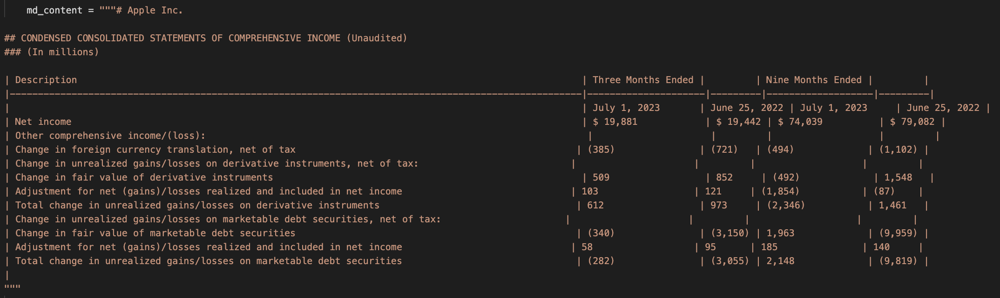

# Introduction

In this blog, I will walk through my process of building a financial chatbot that uses **Retrieval-Augmented Generation (RAG)**. This project leverages **Ollama** as the large language model (LLM) and retrieves financial data from a database of **SEC 10-Q filings** using a hybrid search method combining vector similarity and keyword search.

## Project Overview
- **Goal:** To create a chatbot that provides contextually relevant answers by retrieving financial information from 10-Q filings. This chatbot will be largely on premises meaning I will limit the usage of API's and external libraries where I can.
- **Technology Stack:**
  - Ollama 3.1:7b and 3.2:1b<sup>2</sup>
  - PostgreSQL with pgvector for vector similarity search<sup>3</sup>
  - Python for backend processing
  - Docker for containerization of the database

## RAG in Financial Chatbots

RAG allows us to combine the strengths of information retrieval with the generative capabilities of LLMs. Here, I will discuss why RAG is a good fit for financial document search and analysis.

- **Why RAG?**
  - Traditional LLMs may hallucinate facts. 
  - LLM's have a knowledge cutoff date, meaning they do not have knowledge about recent filings
  - RAG ensures that answers are grounded in real data.<sup>1</sup>
  - RAG also allows us to un-blackbox the knowledge the model uses to make decisions <sup>13</sup>
- **Use Case: SEC 10-Q Filings**
  - The chatbot retrieves data from a curated database of 10-Q filings.

---

# My Process

## CLI Interface

I started this project by setting up the CLI interface. First step was do download the Ollama client, and since I started this project a little after llama3.1 came out, I pulled llama3.1:7b (7 billion parameter model) to my local machine. I then set up a simple while loop to collect user input and then query that information to the Ollama client. Lastly, just to test the model, I set up a little bit of stand in prompt engineering to test the effectiveness of the model for reading the RAG context. 

## Prompt Engineering

Prompt engineering is when you restructure a query for a language model (like GPT) to help guide it to the desired output. A well-designed prompt will help the model understand the task, context, and desired response more effectively.<sup>4</sup> As a start for my model, I designed a system prompt for it. A system prompt is a special prompt passed to the model at the beginning of a chat to help shape the "personality" of the model. Typically they are used to instruct the model how to behave, what to expect from a query, and reinforce certain rules in the chat (Ex: telling the model to avoid reproducing copyrighted material). For my system prompt, I informed the model that it is a financial chatbot and that it's task is to answer financial questions. I also gave it an example of what a sample query might look like so that it is better at reading the engineered queries that will be passed to it. Here is a screenshot of the system prompt :


You'll notice that for the format of injected queries, I use HTML tags to separate out content and I use Markdown bold formatting for the content headers. This is all done to help the LLM better understand the structure of the query, help draw it's attention to the important parts, and prevent confusion for the model.<sup>5</sup> Below is a screenshot of the final result with a markdown table passed in as context. 




## PDF Injest/Parsing

The next step was to create a way to ingest in PDF docs for my RAG pipeline. After reading some reviews<sup>7</sup> of various parsing technologies, I decided that LlamaParse<sup>6</sup> would work best. LlamaParse performs extremely well with financial data and converts everything into Markdown which makes it much easier to store as vectors. This is the only external API I will be using, and decided that it was okay to use because for an on prem chatbot, you could theoretically do all the database setup using internet, as long as the chatbot itself does not rely on internet. I also decided that creating a scraper to automatically ingest documents would be too time consuming to create for this project, so I decided to manually find and download the 10K and 10Q docs. Each document is inserted into a folder called `pdf_files` under the following structure:

- Each company has a folder named simply after the company
- Inside each company folder there are subfolders for each year of data
- Inside each year folder there is a folder called `10Q_10K`. This folder isn’t necessary if I only use 10Q and 10K docs, but it allows for me to add extra financial documents later if I want.
- Lastly, the documents are named according to this format {DocumentType}_{Quarter}_{Year}.pdf

For example, Apple’s Q3 earnings for 2023 has the path `pdf_files/Apple/2023/10Q_10K/10Q-Q2-2023.pdf`. This document naming procedure allows me to keep the naming consistent so that I can identify duplicates/identify docs that have already been parsed. This document structure was chosen for 2 reasons:

1. It makes it very easy to leverage the metadata from the path in my retrieval, or use the LLM to identify a subset of documents that are relevant.
2. It also allows me to check whether a certain document exists by checking if the path exists

Because of the second point above, I was able to structure my script to first create a set of identical directories under a folder called md_files and not parse a document if the associated markdown file already exists in md_files. This is important because I only have a certain number of free files to parse a day using the LlamaParse API, and then I have to wait until the next day to parse the next file.

## Database

For my vector database, I was originally choosing between using sqlite and postgreSQL. I started with trying to use sqlite but quickly ran into a lot of issues with getting sqlite-vss<sup>8</sup> (the vector extension) set up so I opted for PostgreSql instead. PostgreSQL with pgvector<sup>3</sup> was very easy to set up using a docker image, and it was also very easy to integrate with python.

My database has a vector table called embedding_chunks which contains the embeddings for each chunk and the associated year, company, quarter, and document type associated with that chunk. Here is the `\d embedding_chunks` output, which describes the schema of the table: 
```
                                        Table "public.embedding_chunks"
     Column     |          Type          | Collation | Nullable |                   Default                    
----------------+------------------------+-----------+----------+----------------------------------------------
 id             | bigint                 |           | not null | nextval('embedding_chunks_id_seq'::regclass)
 embedding      | vector(768)            |           |          | 
 company        | text                   |           |          | 
 year           | character varying(4)   |           |          | 
 document_type  | character varying(255) |           |          | 
 fiscal_quarter | character varying(2)   |           |          | 
Indexes:
    "embedding_chunks_pkey" PRIMARY KEY, btree (id)
```
My database also contains a relational table called text_chunks which contains the raw text for each chunk and the associated year, company, quarter, and document type associated with that chunk. The id column in the text_chunks table is a primary key, and forms a foreign key with the embedding_chunks table. This means that whenever I need the raw text for a certain embedding, I can just consult this relational table. Here is the `\d text_chunks` output, which describes the schema of the table: 
```
                        Table "public.text_chunks"
     Column     |          Type          | Collation | Nullable | Default 
----------------+------------------------+-----------+----------+---------
 id             | bigint                 |           | not null | 
 text           | text                   |           |          | 
 company        | text                   |           |          | 
 year           | character varying(4)   |           |          | 
 document_type  | character varying(255) |           |          | 
 fiscal_quarter | character varying(2)   |           |          | 
Indexes:
    "text_chunks_pkey" PRIMARY KEY, btree (id)
```
As previously mentioned, the files are stored in a nested directory structure such that the path of each document gives metadata about the fiscal year, company, document type, and fiscal quarter of each document. This is how we get this information when we are populating the database. 

## Embedding

For the embeddings, I created a new file called embedding_gen.py to house the functions for embedding generation. Right now I am using yiyanghkust/finbert-tone<sup>9</sup> from huggingface to generate my embeddings. I made this initial decision based on a paper from Yepes et al.<sup>10</sup> that speaks about effective chunking of Financial Resports for RAG. Although they use a different technology stack (Weviate DB and Chipper for parsing), I grab two key elements from the paper. First, they mention FinBert in the paper, so I thought this would be a good place to start. Second and most important, they discuss the benefits of treating tables differently than embeddings when chunking, because tables do not embed well. I will discuss how I approach this in the following **chunking** section. I will play around with other embedding models after evaluation metrics have been created to see if other models might yield better results. I then created an ingest script called populate_db.py that will go through all the files in md_files, chunk them, create embeddings using the embedding_gen.py function, and then store those embeddings into the pgvector database. I also insert the plain text used to generate each embedding into a relational table where an integer ID is used to link entries between the two tables.


## Chunking

As a starting point I decided to chunk the documents into 200 token chunks, but this does not perform very well for many reasons:

- This token length is not enough to capture many of the tables in one single chunk
- There is no context overlap from chunk to chunk, so many important chunks get cut in half

To make the chunking more effective I implemented a chunking algorithm with the following features:

- **Tables are separated into their own chunks.** By separating the tables into their own chunks, I can treat them differently when creating the embeddings. Tables are put into markdown format when parsing, which means they are very readable by the LLM; however, Markdown tables are horrible for any form of vector retrieval (like cosine similarity) so I need to convert them into some other form before embedding. My first idea was to use Llama to generate AI summaries of the table, which would then be substituted for the table when embedding. This idea seems to work fairly well, but due to computation limitations, I am worried about the scalability. Luckily, I only need to run the chunking algorithm once for the final version, so I might use an AWS instance with better compute for the final chunking. 
- **Each chunk starts with a section header.** By making sure a chunk always starts at the start of a section it decreases the chance of splitting up related info into separate chunks. Not every section is small enough to fit into one chunk, so in these cases, the section is split into smaller chunks on sentence ending (to prevent sentences from being split up). Splitting between sentences could mean that certain ideas are split up between chunks, so I will try and implement a 10-20% content overlap when this happens (TODO).
- **Chunks cannot be bigger than 512 tokens.** This is because of the encoder I am using. yiyanghkust/finbert-tone is based off the BERT model, which requires token lengths of 512 or less. I also make sure not to use padding when creating my encodings to prevent errors. 


## Database Search

Now that I have set up the vector database, the next step is to decide on how I am going to perform my database search. In a RAG pipeline, you will have a vector database populated with vectors in the form of embeddings generated from your text corpus. You then have to figure out a way to search that database to retrieve information related to the users query. My database search can be broken down into two key steps:

1. **Filter Extraction**

2. **Vector Similarity Search**

### Filter Extraction

One early issue that I encountered with retrieval was making sure that the right document is being returned, rather than similar content from an unintended document. For example, say I am asking about Apple's debt in 2023. Language describing debt is common in any 10Q/10K file, and so it is likely to return that content from a 10Q/10K file from a different year, or even a different company. 

To make my searching much more accurate, I decided it would be worth extracting out the relevant companies, years, and quarters from the user's query to use as filters before performing Vector Similarity Search. The first step is to query the same LLM (llama3.1:7b) used for user conversation, and ask it to extract the years and companies related to the query into a list format. Below is an example of what this might look like:

**User Query:**
```
User: How much debt did tesla have in 2024?
```
**LLM Response:**
```
Based on your prompt, here are the companies and years extracted from the user's query:

**Companies** = ['Tesla']
**Years** = [2024]
**Quarters** = []
```
The LLM will always give the three lists in the same format, so I can easily parse and extract the three lists using a simple regex expression. After this parsing step, I will have three variables, one containing the list of related companies, the other the list of related years, and the last containing a list of related quarters (if any). 

As you remember earlier, the vector database contains columns for companies, years, and quarters that were extracted from the local document file structure. I can use the lists of information extracted from the users prompt to then perform a SQL query that will return only the relevant vectors for the users query based on company, year, and quarter (when applicable). This will greatly improve retrieval accuracy by preventing chunks from unrelated documents from sneaking into the top_n chunks retrieved. 

### Vector Similarity Search
After retrieving the filtered vectors, the RAG pipeline will then use Vector Similarity Search to find the entries that are closest to the query the user asks. There are many forms of Vector Similarity search:

1. Exact Nearest Neighbors (Brute Force Search): This algorithm computes the distance between a query vector and all vectors in the dataset, ranking them by similarity. Although precise, brute-force search becomes computationally expensive with larger datasets, making it less practical for real-time applications unless optimized with GPU acceleration or indexing.

2. Approximate Nearest Neighbors (ANN) Algorithms: ANN algorithms aim to find nearest neighbors faster than brute-force by approximating results. They include:

    - HNSW (Hierarchical Navigable Small World): A graph-based algorithm that builds a multi-layered proximity graph to connect similar points, allowing for fast traversal and search. HNSW is popular for high-speed, high-accuracy approximate searches in large datasets.

    - FAISS (Facebook AI Similarity Search): Developed by Meta, FAISS includes various indexing methods (e.g., IVF, PQ) for efficient ANN searches on large datasets. FAISS is highly optimized and performs well on GPUs, making it suitable for large-scale RAG systems.

    - Annoy (Approximate Nearest Neighbors Oh Yeah): Annoy creates binary trees to partition data, which makes it fast for read-heavy, large-scale applications, though it sacrifices some accuracy compared to other algorithms.

3. Product Quantization (PQ): PQ compresses vectors by segmenting and encoding them into lower dimensions, then applies an inverted index for fast searching. While it reduces storage and speeds up similarity searches, PQ may reduce precision, so it’s often used in combination with other methods like FAISS.

There are many more algorithms than just these three, but I will not go into them for the sake of keeping it brief. Since my dataset will be very small, as this is just a POC, I will be opting for the Exact Nearest Neighbors brute force method. This is because it will give me the highest accuracy out of the options provided, and I shouldn't need to worry about computation costs or performance. 

Exact nearest neighbors (and many of the other search algorithms) need a similarity function to be able to calculate similarity between the embedding generated from the users query and the embeddings in the database. A couple of common similarity functions are Cosine Similarity, Euclidean Distance, Manhattan Distance (L1 Distance), Dot Product (Inner Product), and Hamming Distance. I will not go into detail on these, as many are unrelated to vector embedding similarity. Cosine Similarity and Dot Product Similarity are the only two that are typically used with embeddings, and we will be going with Cosine Similarity since it is generally better and Dot Product Similarity requires the embeddings to be normalized. 

Steps 1 and 2 of the database search are actually implemented in my code as a simple SQL query. Step 1 takes the form of a SELECT statement using a WHERE clause to filter by company, year, and fiscal quarter. Step 2 is achieved by then using an ORDER BY clause on the resulting SELECT statement to order the results by cosine similarity to the user query embedding, where the most similar results are displayed first. 

## RAG Pipeline

The RAG pipeline from a very high level consists of the following steps (I would like to note that this is a very high level description, and there are a lot more nuances that go into setting up a RAG pipeline):

1) Grab user input

2) Create embedding from user query

3) Perform Vector Similarity Search on DB (as described in the previous section)

4) Take the Chunks returned from step 3 and insert it as context into the original query 

5) Take the context-enhanced query and pass it to the LLM as part as the user's conversation


## Evalutation

Evaluating a RAG pipeline is a hard and tedious task, that has many possible routes to take, but no one best technique or strategy. Much of it is trial and error, and so this can take a lot of time and energy. I wanted to start my evaluation pipeline by using some form of context relevance algorithm to give measurable metrics on the performance of my RAG. The reason I went this route is because context relevance algorithms typically are the best way to provide some number that measures the performance of my RAG, which will give undeniable proof of improvement or deterioration of my Retrieval when tuning. This is very similar reasoning to why we use metrics like f1, precision, and recall as a performance metric in standard machine learning tasks. 

#### Evaluation Dataset

Before diving into performance metrics, I need a dataset to run these metrics against. The metrics that I will focus on require me to have a dataset containing sample queries the user might ask, and the associated context from the document database that should be retrieved based on that query. A query could have any number of relevant documents returned, so for this reason, I will be using a JSON datastructure to store the evaluation dataset. 

The first step in developing this dataset is to gather a list of queries that the user might ask. I started with about 40 queries, since I would have to build this dataset manually, so even 100 rows would take a considerable amount of time to create. 

#### Retreival Evaluation Metrics<sup>12</sup>

There are a lot of different performance metrics that one can use for RAG when evaluating, and they fall into many different categories. All of the different metrics can be identified as one of two types: 1) Binary Relevance Metrics<sup>11</sup> and 2) Graded Relevance Metrics. Binary relevance metrics will work off the assumption that a retrieved document is either "relevant" or "irrelevant", basically categorizing the retrieved documents into black and white classes; however, Graded Relevance Metrics instead aim to identify “shades” of relevance as opposed to black and white “is relevant” and “is not relevant”. For the purpose of this project, I will start by focusing on binary relevance, as it is a lot more simple to implement, and a lot more applicable in my use case (if I ask for earnings of a company, the returned chunks either answer the question or don't. There is no in-between.)

Binary Relevance Metrics can be broken down further into two sub-categories: 1) Order Unaware and 2) Order Aware. These two categories are fairly self explanatory, where order unaware will grade based on the total number or relevant documents returned regardless of order, whereas order aware will give better grades when relevant documents are more towards the beginning of the returned documents.

To start simple, I decided that I would begin by implementing the two most basic Order Unaware Binary Relevance Metrics: Precision@k and Recall@K. These metrics are very similar to their counterparts in classical machine learning. Precision@k examines how many items in the retrieved chunk set are relevant, where K is the number of chunks considered. It is ideal for scenarios where the accuracy of each result is more important than finding every possible relevant result. K operates like a sliding window, allowing us to consider the metric's value at a given position. One limitation of Precision@k is that it does not consider the relative position of results. It is calculated as follows: 
$$Precision@k = {True Positives@k \over (True Positives@k)+(False Positives@k)}.$$
 

Recall@k determines how many relevant results your retrieval step returns from all existing relevant results for the query, where K is the number of results considered. This statistic is ideal for scenarios where capturing all relevant items in the result set is essential, even if this means including some irrelevant ones. It is helpful when the cost of missing a relevant document is high, or the user is willing to review more results. It is calculated as follows: 
$$Recall@k = {True Positives@k \over (True Positives@k)+(False Negatives@k)}.$$


F1@k combines precision and recall into a single metric, so it was a no brainer to also implement this as well. It is beneficial in scenarios where you must balance retrieving all relevant items (recall) and ensuring they are applicable (precision), and is helpful in situations where missing relevant documents or retrieving too many irrelevant items is costly. This is perfect for my scenario, so I will be heavily relying on F1@k. It is calculated as follows:
$$F1@k = {2 * (Precision@k) * (Recall@k) \over (Precision@k) + (Recall@k)}.$$

#### Generation Evalution Metrics

For a RAG pipeline you typically want to assess both the retrieval results and the generation results from the LLM. This is to make sure that the RAG is retrieving the correct information, and that the LLM is drawing the correct conclusions from that information and overall functioning properly. For my generation evaluation, I didn't want to have to build out a whole other dataset for generation evalutation, as the retrieval dataset discussed earlier only functions for retrieval evaluation. 

I decided that I wanted to do something more novel to automate the generation process. Instead of develop a dataset of sample queries and the desired outputs, I decided to automatically generate very simple queries with yes/no answers about the performance of each company I wanted to assess. Then, I can calculate what the answer should be based on stock analysis of the company. For example, say Ford went down by 2% in the Q2 of 2023. I could algorithmically grab that information from API's and then make sure the LLM says "no" to the question "Did Ford perform well in Q2 2023?" This way I do not have to spend hours manually generating these generation queries and desired outputs.  

To achieve this I leveraged Y-Finance's Python API to retrieve stock information. I decided that it would be smart to assess performance on a quarterly basis. This decision was made to keep my generation analysis in the same context as my retrieval analysis, since I focus on quarterly information retrieval in that dataset. I calculate the timeperiod for a specific quarter based on passing the start of the companies fiscal year from a predefined dictionary and calculating out even quarters of 90 days. I then grab the stocks OHLCV (Open High Low Close Volume) data for a specific quarter in daily intervals. I do not think that I would have a need for more granular data (1 minute, 5 minute, etc. intervals) based on my use case and higher granualarity typically means the data costs more (YFinance is free). 

I assess the performance of the company during the given quarter based on 3 metrics. I calculate the percentage change in ticker price for that quarter based off the closing prices. The percent change in a company's stock price reflects its overall performance in terms of value appreciation or depreciation. Positive changes can indicate strong financial results. I also calculate the volatility during the given quarter by assessing the standard deviation of returns. High volatility can suggest unstable investor sentiment or reactions to news/events, while low volatility may reflect stability and steady performance. Lastly, I calculate average trading volume using the volume data. High trading volumes typically come with large price movements, showing active investor engagement, while low volumes may indicate a lack of interest or uncertainty. Together these three metrics show a comprehensive evaluation of company performance for a quarter. Binary threshholds are set to then define what consitutes "good" performance vs. "bad" performance based on these metrics. For percent change, I have set positive performance to a value of +5% change or more. This is because many of the top S&P 500 stocks are large-cap, mature companies with moderate growth rates. A +5% quarterly price change is significant for these stocks, signaling strong performance. For volatility, I have set positive performance as less than 5% volatility. This is because these stocks tend to have lower volatility compared to smaller-cap stocks. Lastly, average trading volume greater than 1,000,000 shows positive performance. This is a conservative value since S&P 500 stocks typically have high liquidity and I want to avoid incorrectly stating poor performance. 

## Initial Results & Performance

Now that I have a fully functioning RAG pipeline with robust evaluation metrics, I can discuss my initial findings pre-optimization. 

### Retrieval Evaluation Results & Performance

The first step in evaluating my RAG pipeline is to test the retrieval at various k values. As a refresher, k is the number of documents we retrieve and return back to the LLM for analysis. One important thing to note before continuing is that vector retrieval is deterministic, so running this test for a certain k value will always return the same results. I tested k values 1 through 5 to see what k value gives the best results and what the spread looks like. Below is a graph showing the average values for Precision@k, Recall@k, and F1@k for each k value. The averages are calculated by taking the average scores for each of the 40 test queries in my retrieval evaluation dataset. 

 

Starting with precision, we can see that starts high and decreases as k increases. This makes sense because precision is a measure of how many of the returned chunks are relevant, and as k increases, relevant chunks are bound to be diluted by irrelevant chunks. Looking at recall next, we can see that recall increases as k increases. This also makes sense because Recall is a measure of how many of the total relevant chunks you ended up retrieving, and increasing k results in higher possibility of retrieving more relevant chunks. Lastly, f1 seems to have a somewhat concave relationship. F1 is the balance between precision and recall, so this makes sense cue to recall's slight concavity. 

For our purposes, we are going to worry more about precision rather than recall. This is because most questions that could be asked can be answered with a subset of the relevant chunks (meaning recall is not as important), and we are a lot more concerned with not diluting the top k chunks because irrelevant chunks sneaking in could confuse the LLM when drawing a conclusion (meaning precision is much more important). Lastly, we still want to balance the two out so we will look at f1 as a measure of making sure we are balancing the two well. Because of this, k = 2 seems to be the right choice to use. Below is a detailed breakdown of the results for k = 2 showing statistics broken down by company and query keyword

**Results for k = 1:**
```
Average Precision@k: 0.425
Average Recall@k: 0.18416666666666665
Average F1@k: 0.24416666666666664

Company Averages:
Company: Apple, Precision@k: 0.20, Recall@k: 0.20, F1@k: 0.20
Company: Tesla, Precision@k: 0.20, Recall@k: 0.07, F1@k: 0.10
Company: Nvidia, Precision@k: 0.60, Recall@k: 0.20, F1@k: 0.29
Company: Microsoft, Precision@k: 0.40, Recall@k: 0.09, F1@k: 0.15
Company: Meta, Precision@k: 0.80, Recall@k: 0.47, F1@k: 0.57
Company: Google, Precision@k: 0.40, Recall@k: 0.15, F1@k: 0.21
Company: Berkshire Hathaway, Precision@k: 0.33, Recall@k: 0.14, F1@k: 0.19
Company: Amazon, Precision@k: 0.50, Recall@k: 0.17, F1@k: 0.25

Keyword Averages:
Keyword: revenue, Precision@k: 0.12, Recall@k: 0.03, F1@k: 0.05
Keyword: earnings per share (EPS), Precision@k: 0.75, Recall@k: 0.23, F1@k: 0.35
Keyword: total assets, Precision@k: 0.25, Recall@k: 0.25, F1@k: 0.25
Keyword: debt, Precision@k: 0.62, Recall@k: 0.24, F1@k: 0.34
Keyword: total cash, Precision@k: 0.38, Recall@k: 0.17, F1@k: 0.23
```


**Results for k = 2:**
```
Average Precision@k: 0.35
Average Recall@k: 0.31333333333333335
Average F1@k: 0.3113095238095239

-------------------------------------------------
Company Averages:
-------------------------------------------------
Company: Apple
    Precision@k: 0.20, Recall@k: 0.30, F1@k: 0.23
Company: Tesla 
    Precision@k: 0.30, Recall@k: 0.20, F1@k: 0.24
Company: Nvidia
    Precision@k: 0.60, Recall@k: 0.52, F1@k: 0.51
Company: Microsoft
    Precision@k: 0.30, Recall@k: 0.14, F1@k: 0.19
Company: Meta
    Precision@k: 0.50, Recall@k: 0.57, F1@k: 0.51
Company: Google
    Precision@k: 0.20, Recall@k: 0.15, F1@k: 0.17
Company: Berkshire Hathaway
    Precision@k: 0.33, Recall@k: 0.36, F1@k: 0.33
Company: Amazon
    Precision@k: 0.38, Recall@k: 0.25, F1@k: 0.30
-------------------------------------------------

-------------------------------------------------
Keyword Averages:
-------------------------------------------------
Keyword: revenue
    Precision@k: 0.25, Recall@k: 0.17, F1@k: 0.20
Keyword: earnings per share (EPS)
    Precision@k: 0.44, Recall@k: 0.27, F1@k: 0.33
Keyword: total assets
    Precision@k: 0.25, Recall@k: 0.50, F1@k: 0.33
Keyword: debt
    Precision@k: 0.50, Recall@k: 0.35, F1@k: 0.41
Keyword: total cash
    Precision@k: 0.31, Recall@k: 0.27, F1@k: 0.29
-------------------------------------------------

```

From here we can see that Nvidia and Meta seem to perform a bit better than other companies on the same questions. My guess would be that their documents are structured in a way that makes the vector retrieval slightly better, at least for the FinBERT embeddings. Meta and Google perform exceptionally bad, and I would assume that this is also due to their structure. 

There is a bit more consistency across the keyword averages than the company averages which could lead us to believe that variations in document structure and setup from company to company causes much more issues than varying the question being asked. We also see that the highest scoring queries are related to EPS and debt, where the lowest scoring keywords are related to revenue and debt. EPS and debt information is typically more self contained in their own tables, and also is sometimes included in body paragraphs. That could explain why it is more easily retrieved than revenue and total assets, which is typically included in the larger Consolodated Balance Sheets table and is not mentioned nearly as mugh in body paragraphs.

From these results, it seems as though k = 2 will be a valid k value to use in the future, although k = 3 could still be used without sacrificing too much precision and still maximizing f1 score. Next we will examine the generation evaluation.

**Results for k = 3:**
```
Average Precision@k: 0.30000000000000004
Average Recall@k: 0.3925
Average F1@k: 0.32017857142857153

Company Averages:
Company: Apple, Precision@k: 0.13, Recall@k: 0.30, F1@k: 0.18
Company: Tesla, Precision@k: 0.33, Recall@k: 0.32, F1@k: 0.32
Company: Nvidia, Precision@k: 0.53, Recall@k: 0.62, F1@k: 0.53
Company: Microsoft, Precision@k: 0.27, Recall@k: 0.34, F1@k: 0.26
Company: Meta, Precision@k: 0.33, Recall@k: 0.57, F1@k: 0.41
Company: Google, Precision@k: 0.20, Recall@k: 0.20, F1@k: 0.19
Company: Berkshire Hathaway, Precision@k: 0.28, Recall@k: 0.44, F1@k: 0.33
Company: Amazon, Precision@k: 0.33, Recall@k: 0.33, F1@k: 0.33

Keyword Averages:
Keyword: revenue, Precision@k: 0.25, Recall@k: 0.23, F1@k: 0.23
Keyword: earnings per share (EPS), Precision@k: 0.42, Recall@k: 0.38, F1@k: 0.39
Keyword: total assets, Precision@k: 0.17, Recall@k: 0.50, F1@k: 0.25
Keyword: debt, Precision@k: 0.38, Recall@k: 0.40, F1@k: 0.38
Keyword: total cash, Precision@k: 0.29, Recall@k: 0.46, F1@k: 0.35
```

**Results for k = 4:**
```
Average Precision@k: 0.25625
Average Recall@k: 0.4227083333333333
Average F1@k: 0.3001388888888889

Company Averages:
Company: Apple, Precision@k: 0.10, Recall@k: 0.30, F1@k: 0.15
Company: Tesla, Precision@k: 0.30, Recall@k: 0.38, F1@k: 0.34
Company: Nvidia, Precision@k: 0.40, Recall@k: 0.57, F1@k: 0.44
Company: Microsoft, Precision@k: 0.25, Recall@k: 0.37, F1@k: 0.26
Company: Meta, Precision@k: 0.25, Recall@k: 0.57, F1@k: 0.34
Company: Google, Precision@k: 0.25, Recall@k: 0.33, F1@k: 0.27
Company: Berkshire Hathaway, Precision@k: 0.25, Recall@k: 0.50, F1@k: 0.32
Company: Amazon, Precision@k: 0.25, Recall@k: 0.33, F1@k: 0.29

Keyword Averages:
Keyword: revenue, Precision@k: 0.25, Recall@k: 0.27, F1@k: 0.25
Keyword: earnings per share (EPS), Precision@k: 0.34, Recall@k: 0.41, F1@k: 0.37
Keyword: total assets, Precision@k: 0.12, Recall@k: 0.50, F1@k: 0.20
Keyword: debt, Precision@k: 0.38, Recall@k: 0.54, F1@k: 0.44
Keyword: total cash, Precision@k: 0.19, Recall@k: 0.40, F1@k: 0.25
```

**Results for k = 5:**
```
Average Precision@k: 0.21500000000000008
Average Recall@k: 0.42458333333333337
Average F1@k: 0.2718867243867244

Company Averages:
Company: Apple, Precision@k: 0.12, Recall@k: 0.37, F1@k: 0.17
Company: Tesla, Precision@k: 0.32, Recall@k: 0.50, F1@k: 0.39
Company: Nvidia, Precision@k: 0.40, Recall@k: 0.72, F1@k: 0.48
Company: Microsoft, Precision@k: 0.16, Recall@k: 0.17, F1@k: 0.17
Company: Meta, Precision@k: 0.24, Recall@k: 0.61, F1@k: 0.33
Company: Google, Precision@k: 0.16, Recall@k: 0.30, F1@k: 0.20
Company: Berkshire Hathaway, Precision@k: 0.13, Recall@k: 0.39, F1@k: 0.19
Company: Amazon, Precision@k: 0.20, Recall@k: 0.33, F1@k: 0.25

Keyword Averages:
Keyword: revenue, Precision@k: 0.23, Recall@k: 0.31, F1@k: 0.25
Keyword: earnings per share (EPS), Precision@k: 0.33, Recall@k: 0.48, F1@k: 0.38
Keyword: total assets, Precision@k: 0.10, Recall@k: 0.50, F1@k: 0.17
Keyword: debt, Precision@k: 0.28, Recall@k: 0.50, F1@k: 0.35
Keyword: total cash, Precision@k: 0.15, Recall@k: 0.33, F1@k: 0.21
``` 


### Generation Evalution Results & Performance

After evaluating the retrieval metrics, the next step is to evaluate the generation step, which involves using the LLM to generate a response for the user based off the context. Unlike the retrieval evaluation, The generation evaluation is not deterministic meaning that you can get different results if you run it multiple times. This is largely because the LLM is not deterministic in it's responses, so the LLM could always replay differently on another run of the same code. 

The generation evaluation code is ran 5 times and averaged across those 5 trials to get more accurate values and help solve the issue of lack of determinism. I ran this code for k values 2 through 5, since the code takes longer to run and I knew that k = 1 would not be a viable option (recall too low from retrieval evaluation). First, Let's examine the overall everages for each k value.

```
Overall Average For k = 2: 0.5401680672268907
Overall Average For k = 3: 0.5462626262626262
Overall Average For k = 4: 0.505134768540287
Overall Average For k = 5: 0.537697253068381
```

So there are 2 main things I notice here. First, I notice that these scores are really bad. We are technically having the LLM decide between a binary value (good performance vs bad performance), so a baseline of completely random guessing on each question would have a theoretical accuracy of ~50%. My LLM seems to be guessing around 53% which means it is barely better than a random guess. The second thing I notice is that changing the k value does not seem to influence the accuracy at all. This could be an indication that retrieval size does not affect the LLM output, but I think it is much more likely that the poor performance of the pipeline in general masks any differences in accuracy we might see for various k values.

Another important thing I want to highlight is how these k values affect the LLM's ability to draw a conclusion for the answer. When the LLM is not provided relevant context, the LLM will opt to say something along the lines of "I can't provide an answer to that query. Is there another question I can help you with?" The LLM answers this way because it has been instructed not to give an answer when it is not provided correct context to prevent hallucination. For k = 2, there were 41 instances where the LLM could not create an answer. For k = 3, there were 24 instances, k = 4 there were 8 instances, and lastly for k = 5 there were only 3 instances. This shows a clear trend of the LLM being able to provide better answers when k is greater, due to having more context to work with. Now this is directly contrasting to what we saw in retrieval evaluation, but makes sense because it seems as though higher recall leads to better generation for the LLM. What this means is that for optimization, I will pay greater attention to the F1 score in an attempt to balance precision and recall.

Next, I am going to analyze these scores broken down by company, just as I did for the retrieval evaluation. One thing to note before continuing is that I have not included Berkshire Hathaway and Google into this data because they both split their stocks between multiple classes which makes this analysis much more difficult for those stocks. Below I have provided a bar chart showing the accuracy breakdown per company across k values 2 through 5. 

 

Now what we will notice from this chart is that there are some clear underperformers, and some clear winners. We can see that Amazon performs consistently well across multiple k values, with Tesla as a more volatile runner-up. Nvidia is a clear underperformer, with all accuracies below 50%. What I find interesting about this is that these over and underperformers seems to be opposite to how they scored on retrieval. Nvidia scored consistently high on retrieval whereas Amazon and Tesla scored consistently low on retrieval. This could indicate that increases score in retrieval might not lead necessarily to increases in generation; however, I think a much more likely explanation has to do with the fact that the generation questions are much more vague than the retrieval questions, resulting in different performances in retrieval based on the algorithm used and the wording of the companies documents.

This analysis makes it seem as though my RAG pipeline has been an overall failure, which I want to assure you is not the case. There are many situations where we can see the retrieval working and the LLM benefitting from the RAG pipeline. Below is an example taken from the k = 5 generation evaluation run (where we were getting the least amount of response failures). The LLM was asked whether Apple performed well for Q2 of 2023, and the stock had a percentage change change of -7.51% during that quarter. The LLM correctly indicated poor performance for that quarter with the following reasoning:

```Reasoning: The context suggests that Apple's total net sales decreased by 3% and 4% in the three months and six months ended April 1, 2023, respectively, compared to the same periods in 2022. This indicates a decline in performance.```

Nevertheless, for every correct answer with good reasoning I see, There are many other examples of the LLM being unable to answer questions, or even the LLM answering incorrectly due to trying to interpret irrelevant information to force an answer. 

## Improvements and Optimization
Here is the current RAG pipeline I have described so far:

 

There are a number of places to improve on in this pipeline. I will detail 4 different techniques I will aim to implement to see if I can improve on both retrieval and generation evaluation metrics.

#### Table Summarization Prompt
Starting from the retrieval Evaluation, I noted that it seems as though tables are a lot more difficult to accurately retrieve based on the user's query. To try and improve this, I am going to try and restructure the prompt passed to Ollama to better instruct the model how to summarize tables. This should hopefully improve the retrieval evaluation metrics.

#### Hybrid Search
Right now, the retrieval step only utilizes Cosine Similarity Vector Search to retrieve documents which works well but has it's limitations. One common optimization introduced into most RAG pipelines is Hybrid Search. Hybrid Search involves using a Vector Search algorithm alongside a standard Keyword Search algorithm and returning the results of each algorithm together. This typically results in higher recall and precision since you are combining the semantic understanding of vector search with the specificity of keyword search. It also helps handle both vague/conversational queries using vector search and highly specific queries using keyword search. Overall, you are simply balancing the strengths and weaknesses of each method by combining them. This should hopefully be a massive boost to the retrieval evaluation metrics.

#### Re-Rank
Another issue that I commonly noticed is that while sometimes the retrieval step is fairly good at filtering out irrelevant chunks, other times it seems as though a bunch of irrelevant information sneaks in. On top of that, due to issues with the chunking process and parsing process (these are hard to get perfect), some gibberish sneaks into the retrieved chunks as well. This is where Re-rank comes into play. Re-rank is a step in information retrieval where the initial set of retrieved chunks is reordered to improve relevance. To implement re-rank, I will probably grab a much larger set of initial chunks using Hybrid search (around 5 to 15 chunks) and then run them through an LLM to re order the returned chunks based on relevance to the user's original query. Then the top k from this re-ordered list will be returned from the retrieval step. This Re-Rank should be helpful for the retrieval evaluation metrics, but I think it will really shine for the generation evaluation metrics, since this will largely help with situations where the LLM was unable to respond due to irrelevant information being passed to it. 

#### Query Restructuring
The last piece I will try to implement is Query Restructuring. Sometimes, there are situations where a user will ask a question that is too vague, or perhaps is phrased in a weird way, and this ends up throwing off the search algorithms retrieval. To try and help this, I can use an LLM to restructure the user's query into a more search-friendly format, so that the search algorithm capabilities are maximized. The best part about this implementation is that it will not involve any extra LLM queries, because I can ask the LLM to perform the restructuring in the same query where the LLM extracts out the company, year, and quarter information from the prompt. Hopefully this will help with the generation step because the question being asked there (did {company} perform well in {quarter} of {year}?) is a fairly vague question. 

This is what my RAG pipeline will look like after implementing these optimizations:

 


## Optimized Results & Performance

**FILL OUT**

---

# Challenges and Solutions

**FILL OUT**

---

# Future Work

**FILL OUT**



---

# References

1. Gao, Yunfan, Yun Xiong, Xinyu Gao, Kangxiang Jia, Jinliu Pan, Yuxi Bi, Yi Dai, Jiawei Sun, Meng Wang, and Haofen Wang. "Retrieval-augmented generation for large language models: A survey." arXiv preprint arXiv:2312.10997 (2023). [Online](https://arxiv.org/abs/2312.10997).

2. [Ollama official site](https://ollama.com/)

3. [PostgeSQL pgvector Documentation](https://github.com/pgvector/pgvector)

4. Sahoo, Pranab, Ayush Kumar Singh, Sriparna Saha, Vinija Jain, Samrat Mondal, and Aman Chadha. "A systematic survey of prompt engineering in large language models: Techniques and applications." arXiv preprint arXiv:2402.07927 (2024). [Online](https://arxiv.org/abs/2402.07927).

5. [Prompt Engineering techniques](https://techtalkwithsriks.medium.com/effective-prompt-engineering-techniques-77dc9a2fbf3e)

6. [LlamaParse Documentation](https://docs.llamaindex.ai/en/stable/llama_cloud/llama_parse/)

7. [Video detailing general RAG challenges, Overview of some basic RAG concepts, etc.](https://www.youtube.com/watch?v=u5Vcrwpzoz8&t=1064s)

8. [SQLite Vector Similarity Search](https://github.com/asg017/sqlite-vss)

9. [huggingface yiyanghkust/finbert-tone](https://huggingface.co/yiyanghkust/finbert-tone)

10. Yepes, Antonio Jimeno, Yao You, Jan Milczek, Sebastian Laverde, and Renyu Li. "Financial report chunking for effective retrieval augmented generation." arXiv preprint arXiv:2402.05131 (2024). [Online](https://arxiv.org/abs/2402.05131v3)

11. Kekäläinen, Jaana. "Binary and graded relevance in IR evaluations—comparison of the effects on ranking of IR systems." Information processing & management 41, no. 5 (2005): 1019-1033. [Online](https://link.springer.com/article/10.1007/s11704-017-7031-7)

12. [RAG Evaluation: Don’t let customers tell you first](https://www.pinecone.io/learn/series/vector-databases-in-production-for-busy-engineers/rag-evaluation/)

13. Lewis, Patrick, Ethan Perez, Aleksandra Piktus, Fabio Petroni, Vladimir Karpukhin, Naman Goyal, Heinrich Küttler et al. "Retrieval-augmented generation for knowledge-intensive nlp tasks." Advances in Neural Information Processing Systems 33 (2020): 9459-9474. [Online](https://dl.acm.org/doi/abs/10.5555/3495724.3496517)