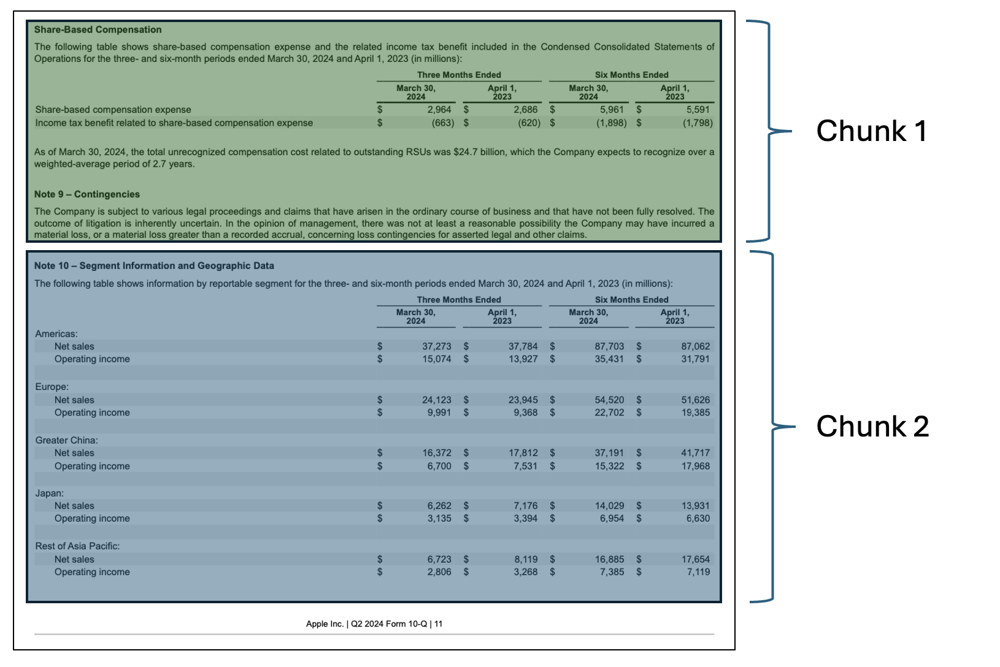

## Table of Contents

1. [Introduction](#introduction)
2. [Project Overview](#project-overview)
3. [RAG in Financial Chatbots](#rag-in-financial-chatbots)
4. [CLI Interface](#cli-interface)
5. [Prompt Engineering](#prompt-engineering)
6. [PDF Injest/Parsing](#pdf-injest-and-parsing)
7. [Database](#database)
8. [Embedding](#embedding)
9. [Chunking](#chunking)
10. [Database Search](#database-search)
11. [RAG Pipeline](#rag-pipeline)
12. [Evalutation](#evalutation)
13. [Initial Results & Performance](#initial-results-and-performance)
14. [Improvements and Optimization](#improvements-and-optimization)
15. [Optimized Results and Performance](#optimized-results-and-performance)
16. [Challenges](#challenges)
17. [Future Work](#future-work)
18. [References](#references)


## Introduction

In this blog, I will walk through my process of building a financial chatbot that uses **Retrieval-Augmented Generation (RAG)**. This project leverages **Ollama** as the large language model (LLM) and retrieves financial data from a database of **SEC 10-Q filings** using a hybrid search method combining vector similarity and keyword search. All of the code for the application referenced in this blog can be found [here](https://github.com/andreaseno/Financial_RAG_LLM).

## Project Overview
- **Goal:** To create a chatbot that provides contextually relevant answers by retrieving financial information from 10-Q filings. This chatbot will be largely on premises meaning I will limit the usage of API's and external libraries where I can.
- **Technology Stack:**
  - Ollama 3.1:7b and 3.2:1b<a href="#ref1" id="note1"><sup>1</sup></a>
  - PostgreSQL with pgvector for vector similarity search<a href="#ref2" id="note2"><sup>2</sup></a>
  - Python for backend processing
  - Docker for containerization of the database

## RAG in Financial Chatbots

RAG allows us to combine the strengths of information retrieval with the generative capabilities of LLMs. Here, I will discuss why RAG is a good fit for financial document search and analysis.

- **Why RAG?**
  - Traditional LLMs may hallucinate facts. 
  - LLM's have a knowledge cutoff date, meaning they do not have knowledge about recent filings
  - RAG ensures that answers are grounded in real data.<a href="#ref3" id="note3"><sup>3</sup></a>
  - RAG also allows us to un-blackbox the knowledge the model uses to make decisions <a href="#ref4" id="note4"><sup>4</sup></a>
- **Use Case: SEC 10-Q Filings**
  - The chatbot retrieves data from a curated database of 10-Q filings.

---

## CLI Interface

I started this project by setting up the CLI interface. First step was to download the Ollama client, and since I started this project a little after llama3.1 came out, I pulled llama3.1:7b (7 billion parameter model) to my local machine. I then set up a simple while loop to collect user input and then query that information to the Ollama client.

## Prompt Engineering

Prompt engineering is when you restructure a query for a language model (like GPT) to help guide it to the desired output. A well-designed prompt will help the model understand the task, context, and desired response more effectively.<a href="#ref5" id="note5"><sup>5</sup></a> As a start for my model, I designed a system prompt for it. A system prompt is a special prompt passed to the model at the beginning of a chat to help shape the "personality" of the model. Typically they are used to instruct the model how to behave, what to expect from a query, and reinforce certain rules in the chat (Ex: telling the model to avoid reproducing copyrighted material). For my system prompt, I informed the model that it is a financial chatbot and that it's task is to answer financial questions. I also gave it an example of what a sample query might look like so that it is better at reading the engineered queries that will be passed to it. Figure 1 shows a a code snippet of the system prompt :

**Figure 1**
```
system_prompt = """You are an AI assistant tasked with answering financial questions.
    Your task is to answer simple questions about a company based on the <context> 
    element of the query.
    Here is an example query in the same format queries will be asked:
    
    ```
    **Context**: <context>
                ...
                <context>
    **Query**: <query>
                ...
                </query>
    ```
    
    When the user asks a question about a company, use information from the <context> 
    element to answer the question asked in <query>. Assume that the <context> 
    information is relevant to the company and time period asked about, even if not 
    explicitly stated.
    
    
    
    
"""
```

You'll notice in Figure 1 that for the format of injected queries, I use HTML tags to separate out content and I use Markdown bold formatting for the content headers. This is all done to help the LLM better understand the structure of the query, help draw it's attention to the important parts, and prevent confusion for the model.<a href="#ref6" id="note6"><sup>6</sup></a> Figure 2 shows an example of a markdown table that could be a chunk passed to the llm through the RAG pipeline, and Figure 3 shows a screenshot of the final result with a markdown table passed in as context. 

**Figure 2**
```
md_content = """# Apple Inc.
## CONDENSED CONSOLIDATED STATEMENTS OF COMPREHENSIVE INCOME (Unaudited)
### (In millions)
| Description                                                                                          | Three Months Ended |         | Nine Months Ended |         |
|------------------------------------------------------------------------------------------------------|---------------------|---------|-------------------|---------|
|                                                                                                      | July 1, 2023       | June 25, 2022 | July 1, 2023     | June 25, 2022 |
| Net income                                                                                           | $ 19,881            | $ 19,442 | $ 74,039          | $ 79,082 |
| Other comprehensive income/(loss):                                                                    |                     |         |                   |         |
| Change in foreign currency translation, net of tax                                                  | (385)               | (721)   | (494)             | (1,102) |
| Change in unrealized gains/losses on derivative instruments, net of tax:                           |                     |         |                   |         |
| Change in fair value of derivative instruments                                                       | 509                 | 852     | (492)             | 1,548   |
| Adjustment for net (gains)/losses realized and included in net income                              | 103                 | 121     | (1,854)           | (87)    |
| Total change in unrealized gains/losses on derivative instruments                                   | 612                 | 973     | (2,346)           | 1,461   |
| Change in unrealized gains/losses on marketable debt securities, net of tax:                      |                     |         |                   |         |
| Change in fair value of marketable debt securities                                                  | (340)               | (3,150) | 1,963             | (9,959) |
| Adjustment for net (gains)/losses realized and included in net income                              | 58                  | 95      | 185               | 140     |
| Total change in unrealized gains/losses on marketable debt securities                               | (282)               | (3,055) | 2,148             | (9,819) |
| 
"""
```
**Figure 3**


## PDF Injest and Parsing

The next step was to create a way to ingest in PDF docs for my RAG pipeline. After reading some reviews<a href="#ref7" id="note7"><sup>7</sup></a> of various parsing technologies, I decided that LlamaParse<a href="#ref8" id="note8"><sup>8</sup></a> would work best. LlamaParse performs extremely well with financial data and converts everything into Markdown which makes it much easier to store as vectors. This is the only external API I will be using, and decided that it was okay to use because for an on prem chatbot, you could theoretically do all the database setup using internet, as long as the chatbot itself does not rely on internet. I also decided that creating a scraper to automatically ingest documents would be too time consuming to create for this project, so I decided to manually find and download the 10K and 10Q docs. Each document is inserted into a folder called `pdf_files` under the following structure:

- Each company has a folder named simply after the company
- Inside each company folder there are subfolders for each year of data
- Inside each year folder there is a folder called `10Q_10K`. This folder isn’t necessary if I only use 10Q and 10K docs, but it allows for me to add extra financial documents later if I want.
- Lastly, the documents are named according to this format {DocumentType}_{Quarter}_{Year}.pdf

For example, Apple’s Q3 earnings for 2023 has the path `pdf_files/Apple/2023/10Q_10K/10Q-Q2-2023.pdf`. This document naming procedure allows me to keep the naming consistent so that I can identify duplicates/identify docs that have already been parsed. This document structure was chosen for 2 reasons:

1. It makes it very easy to leverage the metadata from the path in my retrieval, or use the LLM to identify a subset of documents that are relevant.
2. It also allows me to check whether a certain document exists by checking if the path exists

Because of the second point above, I was able to structure my script to first create a set of identical directories under a folder called md_files and not parse a document if the associated markdown file already exists in md_files. This is important because I only have a certain number of free files to parse a day using the LlamaParse API, and then I have to wait until the next day to parse the next file.

## Database

For my vector database, I was originally choosing between using sqlite and postgreSQL. I started with trying to use sqlite but quickly ran into a lot of issues with getting sqlite-vss<a href="#ref9" id="note9"><sup>9</sup></a> (the vector extension) set up so I opted for PostgreSql instead. PostgreSQL with pgvector<a href="#ref2" id="note2"><sup>2</sup></a> was very easy to set up using a docker image, and it was also very easy to integrate with python.

My database has a vector table called embedding_chunks which contains the embeddings for each chunk and the associated year, company, quarter, and document type associated with that chunk. Figure 4 displays the `\d embedding_chunks` output, which describes the schema of the table: 

**Figure 4**
```
                                        Table "public.embedding_chunks"
     Column     |          Type          | Collation | Nullable |                   Default                    
----------------+------------------------+-----------+----------+----------------------------------------------
 id             | bigint                 |           | not null | nextval('embedding_chunks_id_seq'::regclass)
 embedding      | vector(768)            |           |          | 
 company        | text                   |           |          | 
 year           | character varying(4)   |           |          | 
 document_type  | character varying(255) |           |          | 
 fiscal_quarter | character varying(2)   |           |          | 
Indexes:
    "embedding_chunks_pkey" PRIMARY KEY, btree (id)
```
My database also contains a relational table called text_chunks which contains the raw text for each chunk and the associated year, company, quarter, and document type associated with that chunk. The id column in the text_chunks table is a primary key, and forms a foreign key with the embedding_chunks table. This means that whenever I need the raw text for a certain embedding, I can just consult this relational table. Figure 5 shows the `\d text_chunks` output, which describes the schema of the table: 

**Figure 5**
```
                        Table "public.text_chunks"
     Column     |          Type          | Collation | Nullable | Default 
----------------+------------------------+-----------+----------+---------
 id             | bigint                 |           | not null | 
 text           | text                   |           |          | 
 company        | text                   |           |          | 
 year           | character varying(4)   |           |          | 
 document_type  | character varying(255) |           |          | 
 fiscal_quarter | character varying(2)   |           |          | 
Indexes:
    "text_chunks_pkey" PRIMARY KEY, btree (id)
```
As previously mentioned, the files are stored in a nested directory structure such that the path of each document gives metadata about the fiscal year, company, document type, and fiscal quarter of each document. This is how we get this information when we are populating the database. 

## Embedding

For the embeddings, I created a new file called embedding_gen.py to house the functions for embedding generation. Right now I am using yiyanghkust/finbert-tone<a href="#ref10" id="note10"><sup>10</sup></a> from huggingface to generate my embeddings. I made this initial decision based on a paper from Yepes et al.<a href="#ref11" id="note11"><sup>11</sup></a> that speaks about effective chunking of Financial Resports for RAG. Although they use a different technology stack (Weviate DB and Chipper for parsing), I grab two key elements from the paper. First, they mention FinBert in the paper, so I thought this would be a good place to start. Second and most important, they discuss the benefits of treating tables differently than embeddings when chunking, because tables do not embed well. I will discuss how I approach this in the following **chunking** section. I then created an ingest script called populate_db.py that will go through all the files in md_files, chunk them, create embeddings using the embedding_gen.py function, and then store those embeddings into the pgvector database. I also insert the plain text used to generate each embedding into a relational table where an integer ID is used to link entries between the two tables.


## Chunking

As a starting point I decided to chunk the documents into 200 token chunks, but this does not perform very well for many reasons:

- This token length is not enough to capture many of the tables in one single chunk
- There is no context overlap from chunk to chunk, so many important chunks get cut in half

To make the chunking more effective I implemented a chunking algorithm with the following features:

- **Tables are separated into their own chunks.** By separating the tables into their own chunks, I can treat them differently when creating the embeddings. Tables are put into markdown format when parsing, which means they are very readable by the LLM; however, Markdown tables are horrible for any form of vector retrieval (like cosine similarity) so I need to convert them into some other form before embedding. My idea was to use Llama to generate AI summaries of the table, which would then be substituted for the table when embedding. This idea seems to work fairly well, but due to computation limitations, would not be very scalable; however, this is only meant to be a proof of concept, and I only need to run the chunking algorithm once for the final version, so I will stick with this strategy. 
- **Chunks cannot be bigger than 512 tokens.** This is because of the encoder I am using. yiyanghkust/finbert-tone is based off the BERT model, which requires token lengths of 512 or less. I also make sure not to use padding when creating my encodings to prevent errors. 
- **Each chunk starts with a section header.** By making sure a chunk always starts at the start of a section it decreases the chance of splitting up related info into separate chunks. Not every section is small enough to fit into 512 tokens, so in these cases, the section is split into smaller chunks on sentence ending (to prevent sentences from being split up). 





## Database Search

Now that I have set up the vector database, the next step is to decide on how I am going to perform my database search. In a RAG pipeline, you will have a vector database populated with vectors in the form of embeddings generated from your text corpus. You then have to figure out a way to search that database to retrieve information related to the users query. My database search can be broken down into two key steps:

1. **Filter Extraction**

2. **Vector Similarity Search**

#### Step 1. Filter Extraction

One early issue that I encountered with retrieval was making sure that the right document is being returned, rather than similar content from an unintended document. For example, say I am asking about Apple's debt in 2023. Language describing debt is common in any 10Q/10K file, and so it is likely to return that content from a 10Q/10K file from a different year, or even a different company. 

To make my searching much more accurate, I decided it would be worth extracting out the relevant companies, years, and quarters from the user's query to use as filters before performing Vector Similarity Search. The first step is to use a regular expression to extract the quarters, years, and companies related to the query into a list format. Here is an example of what this might look like:

**User Query:**
```
User: How much debt did tesla have in Q4 2024?
```
**Regex Result:**
```
Companies = ['Tesla']
Years = [2024]
Quarters = ['Q4']
```
The regex will always give the three lists in the same format. After this, I will have three variables, one containing the list of related companies, the other the list of related years, and the last containing a list of related quarters (if any). 

As you remember earlier, the vector database contains columns for companies, years, and quarters that were extracted from the local document file structure. I can use the lists of information extracted from the users prompt to then perform a SQL query that will return only the relevant vectors for the users query based on company, year, and quarter (when applicable). This will greatly improve retrieval accuracy by preventing chunks from unrelated documents from sneaking into the top_n chunks retrieved. 

#### Step 2. Vector Similarity Search
After retrieving the filtered vectors, the RAG pipeline will then use Vector Similarity Search to find the entries that are closest to the query the user asks. There are many forms of Vector Similarity search:

1. Exact Nearest Neighbors (Brute Force Search): This algorithm computes the distance between a query vector and all vectors in the dataset, ranking them by similarity. Although precise, brute-force search becomes computationally expensive with larger datasets, making it less practical for real-time applications unless optimized with GPU acceleration or indexing.

2. Approximate Nearest Neighbors (ANN) Algorithms: ANN algorithms aim to find nearest neighbors faster than brute-force by approximating results. They include:

    - HNSW (Hierarchical Navigable Small World): A graph-based algorithm that builds a multi-layered proximity graph to connect similar points, allowing for fast traversal and search. HNSW is popular for high-speed, high-accuracy approximate searches in large datasets.

    - FAISS (Facebook AI Similarity Search): Developed by Meta, FAISS includes various indexing methods (e.g., IVF, PQ) for efficient ANN searches on large datasets. FAISS is highly optimized and performs well on GPUs, making it suitable for large-scale RAG systems.

    - Annoy (Approximate Nearest Neighbors Oh Yeah): Annoy creates binary trees to partition data, which makes it fast for read-heavy, large-scale applications, though it sacrifices some accuracy compared to other algorithms.

3. Product Quantization (PQ): PQ compresses vectors by segmenting and encoding them into lower dimensions, then applies an inverted index for fast searching. While it reduces storage and speeds up similarity searches, PQ may reduce precision, so it’s often used in combination with other methods like FAISS.

There are many more algorithms than just these three, but I will not go into them for the sake of keeping it brief. Since my dataset will be very small, as this is just a POC, I will be opting for the exact nearest neighbors brute force method. This is because it will give me the highest accuracy out of the options provided, and I shouldn't need to worry about computation costs or performance. 

Exact nearest neighbors (and many of the other search algorithms) need a similarity function to be able to calculate similarity between the embedding generated from the users query and the embeddings in the database. Cosine similarity and dot product similarity are the only two similarity metrics that are typically used with embeddings, and I will be going with cosine similarity since it is generally better and dot product similarity requires the embeddings to be normalized. 

#### Combining Steps 1 & 2
Steps 1 and 2 of the database search are actually implemented in my code as a simple SQL query. Step 1 takes the form of a SELECT statement using a WHERE clause to filter by company, year, and fiscal quarter. Step 2 is achieved by then using an ORDER BY clause on the resulting SELECT statement to order the results by cosine similarity to the user query embedding, where the most similar results are displayed first. 

## RAG Pipeline

From a very high level, the RAG pipeline consists of the following steps (I would like to note that this is a very high level description, and there are a lot more nuances that go into setting up a RAG pipeline):

1) Grab user input

2) Create embedding from user query

3) Perform Vector Similarity Search on DB (as described in the previous section)

4) Take the Chunks returned from step 3 and insert it as context into the original query 

5) Take the context-enhanced query and pass it to the LLM as part as the user's conversation


## Evalutation

Evaluating a RAG pipeline is a hard and tedious task, that has many possible routes to take, but no one best technique or strategy. Much of it is trial and error, and so this can take a lot of time and energy. I wanted to start my evaluation pipeline by using some form of context relevance algorithm to give measurable metrics on the performance of my RAG. The reason I went this route is because context relevance algorithms typically are the best way to provide some number that measures the performance of my RAG, which will give undeniable proof of improvement or deterioration of my Retrieval when tuning. This is very similar reasoning to why we use metrics like f1, precision, recall, RMSE, and R<sup>2</sup> as a performance metric in standard machine learning tasks. 

### Evaluation Dataset

Before diving into performance metrics, I need a dataset to run these metrics against. The metrics that I will focus on require me to have a dataset containing sample queries the user might ask, and the associated context from the document database that should be retrieved based on that query. A query could have any number of relevant documents returned, indicating the need for a semi structreud datastructure. For this reason, I will be using a JSON datastructure to store the evaluation dataset. 

The first step in developing this dataset is to gather a list of queries that the user might ask. I started with about 40 queries, since I would have to build this dataset manually, so even 100 rows would take a considerable amount of time to create. 

### <text id="retrieval_eval_metrics">Retreival Evaluation Metrics</text><a href="#ref12" id="note12"><sup>12</sup></a>

There are a lot of different performance metrics that one can use for RAG when evaluating, and they fall into many different categories. All of the different metrics can be identified as one of two types: **1) Binary Relevance Metrics**<a href="#ref13" id="note13"><sup>13</sup></a> and **2) Graded Relevance Metrics**. Binary relevance metrics will work off the assumption that a retrieved document is either "relevant" or "irrelevant", basically categorizing the retrieved documents into black and white classes; however, Graded Relevance Metrics instead aim to identify “shades” of relevance as opposed to black and white “is relevant” and “is not relevant”. For the purpose of this project, I will start by focusing on binary relevance, as it is a lot more simple to implement, and a lot more applicable in my use case (if I ask for earnings of a company, the returned chunks either answer the question or don't. There is no in-between.)

Binary Relevance Metrics can be broken down further into two sub-categories: **1) Order Unaware** and **2) Order Aware**. These two categories are fairly self explanatory, where order unaware will grade based on the total number or relevant documents returned regardless of order, whereas order aware will give better grades when relevant documents are more towards the beginning of the returned documents.

To start simple, I decided that I would begin by implementing the three most basic Order Unaware Binary Relevance Metrics: Precision@k, Recall@k, and F1@k. These metrics are very similar to their counterparts in classical machine learning. 

#### Precision@k
Precision@k examines how many items in the retrieved chunk set are relevant, where K is the number of chunks considered. It is ideal for scenarios where the accuracy of each result is more important than finding every possible relevant result. K operates like a sliding window, allowing us to consider the metric's value at a given position. One limitation of Precision@k is that it does not consider the relative position of results. It is calculated as follows: 

\\[
  Precision@k = {True Positives@k \over (True Positives@k)+(False Positives@k)}.
\\]

 

#### Recall@k
Recall@k determines how many relevant results your retrieval step returns from all existing relevant results for the query, where K is the number of results considered. This statistic is ideal for scenarios where capturing all relevant items in the result set is essential, even if this means including some irrelevant ones. It is helpful when the cost of missing a relevant document is high, or the user is willing to review more results. It is calculated as follows: 

\\[
  Recall@k = {True Positives@k \over (True Positives@k)+(False Negatives@k)}.
\\]


#### F1@k
F1@k combines precision and recall into a single metric, so it was a no brainer to also implement this as well. It is beneficial in scenarios where you must balance retrieving all relevant items (recall) and ensuring they are applicable (precision), and is helpful in situations where missing relevant documents or retrieving too many irrelevant items is costly. This is perfect for my scenario, so I will be heavily relying on F1@k. It is calculated as follows:

\\[
  F1@k = {2 * (Precision@k) * (Recall@k) \over (Precision@k) + (Recall@k)}.
\\]

### Generation Evalution Metrics

#### Why Generation Evaluation?
For a RAG pipeline you typically want to assess both the retrieval results and the generation results from the LLM. This is to make sure that the RAG is retrieving the correct information, and that the LLM is drawing the correct conclusions from that information and overall functioning properly. For my generation evaluation, I didn't want to have to build out a whole other dataset for generation evalutation, as the retrieval dataset discussed earlier only functions for retrieval evaluation. 

#### My Novel Approach
I decided that I wanted to do something more novel to automate the generation process. Instead of develop a dataset of sample queries and the desired outputs, I decided to automatically generate very simple queries with yes/no answers about the performance of each company I wanted to assess. Then, I can calculate what the answer should be based on stock analysis of the company. For example, say Ford went down by 2% in the Q2 of 2023. I could algorithmically grab that information from API's and then make sure the LLM says "no" to the question "Did Ford perform well in Q2 2023?" This way I do not have to spend hours manually generating these generation queries and desired outputs.  

#### Using YFinance
To achieve this I leveraged Y-Finance's Python API to retrieve stock information. I decided that it would be smart to assess performance on a quarterly basis. This decision was made to keep my generation analysis in the same context as my retrieval analysis, since I focus on quarterly information retrieval in that dataset. I calculate the timeperiod for a specific quarter based on passing the start of the companies fiscal year from a predefined dictionary and calculating out even quarters of 90 days. I then grab the stocks OHLCV (Open High Low Close Volume) data for a specific quarter in daily intervals. I do not think that I would have a need for more granular data (1 minute, 5 minute, etc. intervals) based on my use case and higher granualarity typically means the data costs more (YFinance is free). 

#### How I Asses Performance
I assess the performance of the company during the given quarter based on 3 metrics. I calculate the percentage change in ticker price for that quarter based off the closing prices. The percent change in a company's stock price reflects its overall performance in terms of value appreciation or depreciation. Positive changes can indicate strong financial results. I also calculate the volatility during the given quarter by assessing the standard deviation of returns. High volatility can suggest unstable investor sentiment or reactions to news/events, while low volatility may reflect stability and steady performance. Lastly, I calculate average trading volume using the volume data. High trading volumes typically come with large price movements, showing active investor engagement, while low volumes may indicate a lack of interest or uncertainty. Together these three metrics show a comprehensive evaluation of company performance for a quarter. Binary threshholds are set to then define what consitutes "good" performance vs. "bad" performance based on these metrics. For percent change, I have set positive performance to a value of +5% change or more. This is because many of the top S&P 500 stocks are large-cap, mature companies with moderate growth rates. A +5% quarterly price change is significant for these stocks, signaling strong performance. For volatility, I have set positive performance as less than 5% volatility. This is because these stocks tend to have lower volatility compared to smaller-cap stocks. Lastly, average trading volume greater than 1,000,000 shows positive performance. This is a conservative value since S&P 500 stocks typically have high liquidity and I want to avoid incorrectly stating poor performance. 

## Initial Results and Performance

Now that I have a fully functioning RAG pipeline with robust evaluation metrics, I can discuss my initial findings pre-optimization. 

### <text id="pre_hybrid_results">Retrieval Evaluation Results & Performance</text>

The first step in evaluating my RAG pipeline is to test the retrieval at various k values. As a refresher, k is the number of documents we retrieve and return back to the LLM for analysis. One important thing to note before continuing is that vector retrieval is deterministic, so running this test for a certain k value will always return the same results. I tested k values 1 through 7 to see what k value gives the best results and what the spread looks like. Figure 6 displays a graph showing the average values for Precision@k, Recall@k, and F1@k for each k value. The averages are calculated by taking the average scores for each of the 40 test queries in my retrieval evaluation dataset. 

**Figure 6**
 

Starting with precision, we can see that starts high and decreases as k increases. This makes sense because precision is a measure of how many of the returned chunks are relevant, and as k increases, relevant chunks are bound to be diluted by irrelevant chunks. This is also especially true since some of out evaluation queries only have one or two relevant chunks. Looking at recall next, we can see that recall increases as k increases. This also makes sense because Recall is a measure of how many of the total relevant chunks you ended up retrieving, and increasing k results in higher possibility of retrieving more relevant chunks. Lastly, f1 seems to have a somewhat concave relationship. F1 is the balance between precision and recall, so this makes sense due to recall's and precision's slight opposing concavities. 

For our purposes, we are going to worry more about precision rather than recall. This is because most questions that could be asked can be answered with a subset of the relevant chunks (meaning recall is not as important), and we are a lot more concerned with not diluting the top k chunks because irrelevant chunks sneaking in could confuse the LLM when drawing a conclusion (meaning precision is much more important). Lastly, we still want to balance the two out so we will look at f1 as a measure of making sure we are balancing the two well. Because of this, k = 2 seems to be the right choice to use. Figure 7 has a detailed breakdown of the results for k = 2 showing statistics broken down by company and query keyword.


**Figure 7**
```
Average Precision@k: 0.35
Average Recall@k: 0.31333333333333335
Average F1@k: 0.3113095238095239

-------------------------------------------------
Company Averages:
-------------------------------------------------
Company: Apple
    Precision@k: 0.20, Recall@k: 0.30, F1@k: 0.23
Company: Tesla
    Precision@k: 0.30, Recall@k: 0.20, F1@k: 0.24
Company: Nvidia
    Precision@k: 0.60, Recall@k: 0.52, F1@k: 0.51
Company: Microsoft
    Precision@k: 0.30, Recall@k: 0.14, F1@k: 0.19
Company: Meta
    Precision@k: 0.50, Recall@k: 0.57, F1@k: 0.51
Company: Google
    Precision@k: 0.20, Recall@k: 0.15, F1@k: 0.17
Company: Berkshire Hathaway
    Precision@k: 0.33, Recall@k: 0.36, F1@k: 0.33
Company: Amazon
    Precision@k: 0.38, Recall@k: 0.25, F1@k: 0.30
-------------------------------------------------

-------------------------------------------------
Keyword Averages:
-------------------------------------------------
Keyword: revenue
    Precision@k: 0.25, Recall@k: 0.17, F1@k: 0.20
Keyword: earnings per share (EPS)
    Precision@k: 0.44, Recall@k: 0.27, F1@k: 0.33
Keyword: total assets
    Precision@k: 0.25, Recall@k: 0.50, F1@k: 0.33
Keyword: debt
    Precision@k: 0.50, Recall@k: 0.35, F1@k: 0.41
Keyword: total cash
    Precision@k: 0.31, Recall@k: 0.27, F1@k: 0.29
-------------------------------------------------

```

From here we can see that Nvidia and Meta seem to perform a bit better than other companies on the same questions. My guess would be that their documents are structured in a way that makes the vector retrieval slightly better, at least for the FinBERT embeddings. Apple and Google perform exceptionally bad, and I would assume that this is also due to their structure. 

There is a bit more consistency across the keyword averages than the company averages which could lead us to believe that variations in document structure and setup from company to company causes much more issues than varying the question being asked. We also see that the highest scoring queries are related to EPS and debt, where the lowest scoring keywords are related to revenue and total assets. EPS and debt information is typically more self contained in their own tables, and also is sometimes included in body paragraphs. That could explain why it is more easily retrieved than revenue and total assets, which is typically included in the larger Consolodated Balance Sheets table and is not mentioned nearly as mugh in body paragraphs.

From these results, it seems as though k = 2 will be a valid k value to use in the future, although k = 3 could still be used without sacrificing too much precision and still maximizing f1 score. Next we will examine the generation evaluation.


### Generation Evalution Results & Performance

After evaluating the retrieval metrics, the next step is to evaluate the generation step, which involves using the LLM to generate a response for the user based off the context. Unlike the retrieval evaluation, The generation evaluation is not deterministic meaning that you can get different results if you run it multiple times. This is largely because the LLM is not deterministic in it's responses, so the LLM could always replay differently on another run of the same code. 

#### Results
The generation evaluation code is ran 5 times and averaged across those 5 trials to get more accurate values and help solve the issue of lack of determinism. I ran this code for k values 2 through 5, since the code takes longer to run and I knew that k = 1 would not be a viable option (recall too low from retrieval evaluation). Figure 8 shows the overall averages for each k value.

**Figure 8**
```
Overall Average For k = 2: 0.5401680672268907
Overall Average For k = 3: 0.5462626262626262
Overall Average For k = 4: 0.505134768540287
Overall Average For k = 5: 0.537697253068381
```

#### Analysis
So there are 2 main things I notice here. First, I notice that these scores are really bad. We are technically having the LLM decide between a binary value (good performance vs bad performance), so a baseline of completely random guessing on each question would have a theoretical accuracy of ~50%. My LLM seems to be guessing around 53% which means it is barely better than a random guess. The second thing I notice is that changing the k value does not seem to influence the accuracy at all. This could be an indication that retrieval size does not affect the LLM output, but I think it is much more likely that the implementation I described earlier is not an accurate way to assess generation accuracy.

Another important thing I want to highlight is how these k values affect the LLM's ability to draw a conclusion for the answer. When the LLM is not provided relevant context, the LLM will opt to say something along the lines of "I can't provide an answer to that query. Is there another question I can help you with?" The LLM answers this way because it has been instructed not to give an answer when it is not provided correct context to prevent hallucination. For k = 2, there were 41 instances where the LLM could not create an answer. For k = 3, there were 24 instances, k = 4 there were 8 instances, and lastly for k = 5 there were only 3 instances. This shows a clear trend of the LLM being able to provide better answers when k is greater, due to having more context to work with. Now this is directly contrasting to what we saw in retrieval evaluation, but makes sense because it seems as though higher recall leads to better generation for the LLM. What this means is that for optimization, I will pay greater attention to the F1 score in an attempt to balance precision and recall.

#### Example
This analysis makes it seem as though my RAG pipeline has been an overall failure, which I want to assure you is not the case. There are many situations where we can see the retrieval working and the LLM benefitting from the RAG pipeline. Below is an example taken from the k = 5 generation evaluation run (where we were getting the least amount of response failures). The LLM was asked whether Apple performed well for Q2 of 2023, and the stock had a percentage change change of -7.51% during that quarter. The LLM correctly indicated poor performance for that quarter with the following reasoning:

```Reasoning: The context suggests that Apple's total net sales decreased by 3% and 4% in the three months and six months ended April 1, 2023, respectively, compared to the same periods in 2022. This indicates a decline in performance.```

Nevertheless, for every correct answer with good reasoning I see, There are many other examples of the LLM being unable to answer questions, or even the LLM answering incorrectly due to trying to interpret irrelevant information to force an answer.

## Improvements and Optimization
Figure 9 shows a high level flowchart of the current RAG pipeline I have described so far:

**Figure 9**
 

There are a number of places to improve on in this pipeline; however, due to time constraints I will focus on one technique to implement to see if I can improve on both retrieval and generation evaluation metrics.

### Hybrid Search
Right now, the retrieval step only utilizes Cosine Similarity Vector Search to retrieve documents which works well but has it's limitations. One common optimization introduced into most RAG pipelines is Hybrid Search. Hybrid Search involves using a Vector Search algorithm alongside a standard Keyword Search algorithm and returning the results of each algorithm together. This typically results in higher recall and precision since you are combining the semantic understanding of vector search with the specificity of keyword search.<a href="#ref14" id="note14"><sup>14</sup></a> It also helps handle both vague/conversational queries using vector search and highly specific queries using keyword search. Overall, you are simply balancing the strengths and weaknesses of each method by combining them. This should hopefully be a massive boost to the retrieval evaluation metrics. 

In hybrid search, you take the results of semantic and keyword searches and combine them, but then you need to re-order these results based on a new metric other than cosine similarity. This is where re-rank comes in. Re-rank is a step in information retrieval where the initial set of retrieved chunks is reordered to improve relevance. The hybrid search and re-rank should hopefully be a massive boost to the retrieval evaluation metrics.  

Figure 10 is a flowchart showing what my RAG pipeline will look like after implementing hybrid search and re-rank:

**Figure 10**
 


## Optimized Results and Performance

### Hybrid Search

##### Initial thoughts
To implement hybrid search, I needed to incorporate some form of keyword search into my pipeline and combine the results with semantic (vector-based) search. Keyword search can be challenging to implement from scratch because it involves tasks like tokenization, stemming or lemmatization, stop word removal, and other natural language processing (NLP) tasks that require careful design. Additionally, you need to develop a way to rank and score similarity based on keyword matches, which can be complex.

##### My Solution
Luckily, PostgreSQL supports full-text search, providing built-in tools for tokenization, stemming, stop word removal, and ranking based on text relevance. It uses tsvector to store tokenized and processed text data and tsquery to perform efficient searches. PostgreSQL's scoring mechanism ranks results based on term frequency and other factors. All of this together makes it the perfect choice for implementing keyword search in my hybrid search pipeline without needing to build it entirely from scratch.

##### The Process
To implement the Hybrid search, I first needed to create a new column of tsvectors and create an index on that column. Indexing on tsvectors is typically done using a GIN (Generalized Inverted Index), which significantly improves the performance by allowing fast searching by mapping each token to its occurrences across documents. Figure 11 shows the schema of text_chunks after altering the table to support tsvector.

**Figure 11**
```
                        Table "public.text_chunks"
     Column     |          Type          | Collation | Nullable | Default 
----------------+------------------------+-----------+----------+---------
 id             | bigint                 |           | not null | 
 text           | text                   |           |          | 
 company        | text                   |           |          | 
 year           | character varying(4)   |           |          | 
 document_type  | character varying(255) |           |          | 
 fiscal_quarter | character varying(2)   |           |          | 
 text_vectors   | tsvector               |           |          | 
Indexes:
    "text_chunks_pkey" PRIMARY KEY, btree (id)
    "text_vectors_idx" gin (text_vectors)
```

 Inside the search function, I use the plainto_tsquery() function to convert my plain text query into something that can be accepted by the full text search capabilities of PostgreSQL. plainto_tsquery() converts a plain text string into a tsquery by automatically parsing the input, normalizing the text by applying stemming and removing stop words, and connecting the resulting terms with the logical AND operator. After I have the tsquery, I can use ts_rank() to get a similarity score for each row. ts_rank() assigns higher scores to terms that are more frequent in the query and less common in the dataset, while also factoring in their positional proximity and relevance.

##### Combining Scores
The last step in adding the full text search to my pipeline to create a hybrid search is to merge the results in with the existing semantic search results. To do this, I used the following steps

1. Combine semantic search and keyword search results into one dataframe.
2. Normalize the results using a MinMaxScaler for both scores so that they are on the same scale. 
3. Create a weighted average of the cosine similarity score and the ts_rank() score. 
4. Sort the resulting dataframe by the combined score

##### Results
The results from implementing hybrid search exceeded my expectations. After implementing the pipeline as described in the previous section, I started tuning the weight distribution between the two search methods. What I found is that performance metrics (precision, recall, f1) were optimized when using an 80/20 split in weighting between semantic search and full text search (respectively). After finding the proper weights to optimize the performance, I measured the precision, recall, and f1 scores of the hybrid search pipeline using the same process and evaluation dataset described earlier in the <a href="#retrieval_eval_metrics">Retreival Evaluation Metrics</a> section. Figure 12 demonstrates the improved performance of the hybrid search across all metrics for k values 1 through 5 value using a barchart.

**Figure 12**
 

The bar chart shows an increase in performance for every metric across every k value. There was an average performance increase of 52% across all metrics, with some metrics at certain k values almost doubling in performance. 

Now I need to further examine the performance of the hybrid search implementation at various k values to help me make a data driven decision about what k value to use for the main pipeline going forward. To do so, I will use the line chart displayed in Figure 13 to help examine the trends of each metric as k increases.

**Figure 13**
 

Similar to the <a href="#pre_hybrid_results">pre-hybrid search implementation</a>, precision displays an downward trend, recall displays an upward trend, and f1 displays a concave trend as k increases. Another similarity worth noting is that all three metrics achieve peak balance at k = 2, with precision and recall diverging afterward. 

There is one main difference from the pre-hybrid search graph asside from the overall increase in performance worth highlighting: After balancing out at k = 2, there is a steep dropoff in precision at k = 3 that continues through k = 7. This also results in the same behavior in f1. This is likely due to the weighting from key word search throwing off the added chunks.

Because of this behavior seen, we can still say that for retrieval accuracy on the kind of prompts asked in this dataset, k = 2 will be the most optimized k value to use; however, unlike the analysis before hybrid search, anything past k = 2 will not be as viable due to the steep dropoff in precision (and consequently f1) at k=3 and beyond. Hopefully the re-rank/chunk filtering implementation will help in aleviating the steep dropoff in precision. Figure 14 has a detailed breakdown of the results for k = 2 showing statistics broken down by company and query keyword.

**Figure 14**
```
Average Precision@k: 0.575
Average Recall@k: 0.5537500000000001
Average F1@k: 0.5276190476190477

-------------------------------------------------
Company Averages:
-------------------------------------------------
Company: Apple
    Precision@k: 0.30, Recall@k: 0.33, F1@k: 0.29
Company: Tesla
    Precision@k: 0.70, Recall@k: 0.58, F1@k: 0.60
Company: Nvidia 
    Precision@k: 0.70, Recall@k: 0.63, F1@k: 0.63
Company: Microsoft
    Precision@k: 0.50, Recall@k: 0.54, F1@k: 0.46
Company: Meta
    Precision@k: 0.70, Recall@k: 0.71, F1@k: 0.67
Company: Google
    Precision@k: 0.40, Recall@k: 0.40, F1@k: 0.37
Company: Berkshire Hathaway
    Precision@k: 0.67, Recall@k: 0.75, F1@k: 0.67
Company: Amazon
    Precision@k: 0.62, Recall@k: 0.42, F1@k: 0.50
-------------------------------------------------

-------------------------------------------------
Keyword Averages:
-------------------------------------------------
Keyword: revenue
    Precision@k: 0.25, Recall@k: 0.13, F1@k: 0.17
Keyword: earnings per share (EPS)
    Precision@k: 0.62, Recall@k: 0.41, F1@k: 0.49
Keyword: total assets
    Precision@k: 0.50, Recall@k: 1.00, F1@k: 0.67
Keyword: debt
    Precision@k: 0.88, Recall@k: 0.62, F1@k: 0.72
Keyword: total cash
    Precision@k: 0.62, Recall@k: 0.60, F1@k: 0.60
-------------------------------------------------
```

From here we can see that Nvidia and Meta still are top performaers, but hybrid search also greatly improved the performance of Tesla, Berkshire Hathaway, and Amazon. My guess would be that their documents do not respond as well to vector search, but the keyword search from tsvector helped alleviate this weakness. Apple and Google still perform exceptionally bad, and I would assume that this is also due to their structure.

Debt and Earnings Per Share are still the highest performing keywords by precision, but total cash was greatly increased due to the hybrid search implementation. The lowest scoring keyword is still revenue but something interesting happened to total assets. Total assets used to perform very bad, and it still doesnt perform amazing in terms of precision; however, total assets now has a perfect recall, which might reflects the fact that all my entries in the evaluation dataset for total assets only contain one chunk. Therefore, this means that total assets is actually performing the best out of all the metrics,  since it always retrives all the relevant information within the top 2 chunks for every question.

### Generation Evaluation Improvement

#### The Issue
One major issue with my previous novel approach to generation evaluation was the lack of domain knowledge that went into building it. I originally thought that I could accurately assess company financial performance purely using stock trends alone which is blatantly wrong. While stock trends do show market sentiment, they may not accurately represent the underlying fundamentals of a company, such as revenue growth, profit margins, or debt levels, which are essential for assessing financial performance. By relying solely on stock trends, I failed to incorporate these essential metrics, leading to a potentially misleading evaluation algorithm. 

#### The Solution
Luckily, I realized that YFinance (the library I was already using), has endpoints to retrieve a companies income statement, thus giving me access to the values I need to accurately compute company performance. After doing some research into what metrics/indicators are typically used for evaluating financial health, I settled on assessing Earnings Per Share, Total Revenue, and Net Income to base financial health on. Typically, one would use many more indicators to give a much broader and more comprehensive understanding of the company, but I need to keep my implementation simple so it is a) not too complex and b) easily understandable. 

#### The Implementation
To implement these changes, I worked off of the same code and file I previously used, but rewrote the code to evaluate the company's performance for a given quarter. To do this, I had to get the Earnings Per Share, Total Revenue, and Net Income values for the given quarter, and then use the previous year's values for the same quarter to create growth statistics for each. I had to compare to the previous years quarter (i.e. Q1 2024 vs Q1 2023) rather than compare to the previous quarter of the same year (i.e. Q3 2024 vs Q2 2024) because many companies experience small changes in performance in different seasons, so comparing to the same quarter of the previous year eliminates seasonality in the growth percentage. As for the thresholds I set to determine "good" performance vs "bad" performance, I used 0 for all three statstics, meaning that any amount of positive change in these metrics indicated good performance and any negative change in these metrics indicated poor performance. As for the overall acceptance criteria to return a evaluation, I said that if any two out of the three growth percentages were positive, that would indicate good performance.

#### Results
Just like before, the generation evaluation is not deterministic so the LLM could always replay differently on another run of the same code. One big difference (and drawback) in this implementation is that due to the amount of data I can get from YFinance, I can only evaluate each company once. When I get the income statement information from YFinance, it gives me information about the last 8 quarters; however, the last 3 quarters it gives are for some reason always filled with NaN values. Since I have to compare with previous quarters to prevent seasonality issues, I only get one generation evaluation per company, meaning that a full trial only has a maximum of 8 total generation query evaluations. Because of this, the new generation evaluation code is ran 10 times rather than 5 and is averaged across those 10 trials to get more accurate values and help solve the issue of lack of determinism. I ran this code for k values 1 through 5. Figure 15 shows the overall averages for each k value.

**Figure 15**
```
Overall Average For k = 1: 0.3928571428571429
Overall Average For k = 2: 0.5125
Overall Average For k = 3: 0.3875
Overall Average For k = 4: 0.425
Overall Average For k = 5: 0.625
```

These results are unexpected because I had hoped that introducing more domain knowledge into my generation evaluation approach would show greater accuracy, but it instead made the accuracy slightly worse. The silver lining here is that we know for a fact that this introduced a better evaluation approach. before, when the LLM was always hitting %50 percent, it indicated that the LLM was just taking random guesses and getting it right half of the time (think about the chance of trying to guess a coin toss). Now that our generation evaluation is grounded in more truth, it reveals the flaws in generation for our pipeline. This is further evidenced by the results for k = 2 seen in Figure 16. 

**Figure 16**
```
Overall Average Across 10 trials: 0.5125

Tesla: 8/10 - 0.8
Apple: 5/10 - 0.5
Nvidia: 8/10 - 0.8
Microsoft: 0/10 - 0.0
Meta: 0/10 - 0.0
Amazon: 9/10 - 0.9
Berkshire Hathaway: 9/10 - 0.9
Google: 2/10 - 0.2
```

What we see in this Figure is that it seems certain companies perform extremely well (like Amazon and Berkshire Hathaway) whereas there are multiple companies that just never return a correct answer. This is proof that when given the correct chunks (since retrieval is deterministic) the LLM is able to most of the time generate the correct response and reason well. For the companies where the generataion evaluation underperforms, this could be due to either irrelevant chunks being retrieved, or the format of the chunks and tables retrieved are harder for the LLM to interpret. Figure 17 below shows the same output, but from when I was basing the performance evaluation on stock trends.

**Figure 17**
```
Overall Average Across 5 trials: 0.5401680672268907

Tesla: 33/55 - 0.6
Apple: 13/25 - 0.52
Nvidia: 15/43 - 0.3488372093023256
Microsoft: 25/37 - 0.6756756756756757
Meta: 21/43 - 0.4883720930232558
Amazon: 30/51 - 0.5882352941176471
```

Looking at Figure 16 vs Figure 17, it is clear that the evaluation generation works better. In figure 17, you see all company specific accuracies being around 50%, which again shows random guessing. But in Figure 16, you can see that the new implementation of generation eval causes the LLM to either guess almost completely correct or almost completely incorrect.  

---

## Challenges 
This project was a lofty goal to complete in one semester (3-months), and I was so busy that there is much left to be improved on. I ran into many challenges during the process of building out this Financial LLM. Below I detail many of the challenges I ran into:

### Computational Power Constraints
One of the first challenges I ran into during this project was computational power. LLMs are extremely powerful and robust tool, but they can only achieve their great feats by taking up tons of energy and computational power. I wrote and ran this entire project on my M2 macbook air, which meant that I had no access to powerful GPU's to speed up my LLM calls to Ollama. I am lucky that Ollama is already optimized to run on M2 chips, or else I am not sure if this project would have been viable. 

Nevertheless, the lack of additional computation power severely limited my options when it came to model size and agentic capabilities. I had to stick with the smallest models possible for Ollama 3.1 and 3.2, which meant that I had much less parameters making my model not nearly as intellegent as it could have been. Agentic capabilities refers to the LLM's ability to perform tasks in a goal-oriented or autonomous manner. A few of the agentic capalities I was unable to utilize on my system include Query Expansion (Dynamically refining or expanding the user query to include synonyms, related terms, or additional context to improve retrieval accuracy), Context-Aware Filtering (Filtering irrelevant or redundant chunks dynamically, ensuring the generator only receives highly relevant context), and Iterative Retrieval (Using multiple retrieval steps where the results of one retrieval round inform subsequent queries or retrieval passes).

### Lack of Domain Knowledge
The overarching issue that I feel impacted the performance across the board in all steps was a lack of financial domain knowledge. When it came to creating a chunking algorithm, it was hard to accurately make decisions about what information was relevant and what information was not due to the lack of domain knowledge. When it came time to create my retrieval evaluation dataset, I had issues finding the correct relevant chunks to a certain financial question, leading me to spend extra time having to research how to answer the financial question using a 10Q or 10K document. As mentioned earlier, When I first wrote my novel approach to generation evaluation, it was blatantly inaccurate due to my overly naive approach of using stock data. If I had a better basis in financial knowledge, I probably would've been able to avoid that pitfall all together from the get go. 

### Effective Chunking
The chunking algorithm was the first challenge in this project I experienced that took a significant amount of time to overcome. Due to the specificness of my application, and the fact that I wanted everything to be on premsises (no api calls) as much as possible, I had to develop my own chunking strategy from scratch. I had to rewrite the code multiple times to account for various edge cases while parsing that I had not originally considered, and then I had to rewrite it even more times to more effectively try and group information together. In the end, I had a functioning chunking algorithm, but it had major flaws. First, I left all the table summarization up to an LLM to try and simplify my implementation. I stand by this decision as any other ways of summarizing table would have introduced more complexity into the already overly-complex chunkinng algorithm, but using an LLM meant that the summarizations of these tables was non-deterministic and mostly black-boxed. Due to the large amount of data I was processing, it was impossible to check every summarization so it's very possible that the LLM incorrectly summarized tables making them harder or even impossible to correctly retrieve. The second flaw in my chunking algorithm was that I did not try and filter out irrelevant chunks. This meant that chunks like the table of contents, random sentences, and even sometimes just long strings of headers made it into the database. These along with other small flaws meant that there were issues with my pipeline as early as the data preprocessing step, thus reducing my retrieval accuracy from the start of the pipeline. 

### Rag Pipeline
I would say that the largest success in the whole project was my RAG pipeline. I was able to write a working RAG pipeline with okay accuracy and then definitively prove that hybrid search greatly increased my retrieval performance. I think that my retrieval metrics could have been even higher if my chunking algorithm was better and more robust but that could not be helped. I think that most of the challenges I had with my RAG pipeline were due to not being able to better leverage agentic capabilites and not having enough time to code and test various different optimization techniques. 

### Generation Evaluation
The generation evaluation turned out to be the biggest failure of this project. It was a good idea, and I am still convinced that it could work given the correct setup, but there are a lot of challenges that present themself. As I have mentioned numerous times before, domain knowledge was a massive challenge for the generation evaluation, and it caused me to implement it incorrectly initially. Also, because of the fact that you are using the generation step of the RAG pipeline, the way you set up your generation query can greatly affect your results even if the generation is working well. If the LLM isn't correctly guided to the correct response format, or it it doesn't understand well enough what kind of answer it should be giving, it can greatly throw off accuracy. Lastly interpretting the results of the LLM can be pretty hard. Sometimes, the LLM might give you an answer just because it doesnt know how to answer the question, but you never know if it just got the question wrong or just gave a random response. 

---

## Future Work

### Clone into AWS to Leverage Higher Computational power
One of the first things I would need to do to take this project to the next level would be gain greater computational power to process more data and leverage more computationally expensive optimization techniques. Now the two ways to do this would be buy expensive hardware or use a cloud vendor and leverage their hardware. Now, the hardware I would need to buy would cost thousands of dollars (probably $5,000 or more), and that is way far out of my budget. Instead, it would be cool to move this project into an AWS instance and pay for compute power for that instance. That way I could only pay for the Compute power while I run it and shut down the instance while I am not using it, thus greatly reducing cost.

### Rewrite Chunking Algorithm
The first and most important thing to do to further improve this application would be to write a better chunking algorithm. As previously mentioned, there were major issues with my chunking implementation, and these flaws most likely led to drastically decreased performance. If I increased my computational power as I mentioned, I could use more agentic LLM capabilities to filter chunks before spam made it into the database. On top of that, if I had more time to focus on the chunking, I could better approach the algorithm to group relevant data together and prevent certain non-breaking edge cases from happening.

### Expand Companies and Years contained in Database
Since this project was just a proof of concept, the total amount of data contained in the database is small. There are only 8 of the S&P 500 companies contained in the database, and only for the years 2022-2024. A large part of this was due to the fact that I was using Llamaparse to convert the pdf files into markdown, and it had a daily rate limit. Also, increasing the amount of companies in the database meant increasing the size of the retrieval evaluation dataset to maintain even representation between all the companies in the evaluation, and I did not have time to create a larger evaluation dataset.

Expanding the database could be done manually as I did for this base POC, but what would be even cooler would be to write a webscraper that would automatically download and process the pdf files for you. This would make the database be able to expand at a rapid rate. The reason I did not pursue this in the POC was it was very far outside of the scope of what I wanted to achieve, and would have been a project all in itself.

### Implement More Retrieval Optimizations
Once computational power is increased, it opens the door to numerous retrieval optimization techniques that were previously impossible. There are so many different techniques that for the sake of concision I will name only a couple that are relevant to my use case.

##### Query Expansion/Restructuring
One optimization I wanted to include in the POC but couldn't get around to implementing was agentic query expansion/restructuring. This would involve taking the users original query and passsing it to an LLM to rewrite. There are many reasons to do this, but for my use case it would be useful for two reasons. First, you can ask the LLM to rewrite the query in such a way that it is more suited for either semantic or keyword search. You could even ask it to give two different reworded queries, one to run against semantic search and one to run against the keyword search. This allows you to optimize the query for the specific search algorithm you are using and leverage the strengths of each algorithm to its fullest. Second, you can ask the LLM to restructure potentially vague or misleading queries to better capture what the user is asking. Say the user says "Is Apple a more financially sound investment than Nvidia?" This question is particularly vague, and the retrieval method might not understand the type of information it needs to retrieve to answer the question. Now, you could get the LLM to reword it with domain knowledge you pass to it and it might give something like "Analyze Apple's Earnings Per Share over the last 4 quarters (Q1 through Q4) of 2024 and compare it to the same statistics for Apple. How can this information affect which I invest in?" Now the LLM and the RAG pipeline has a lot more information to go off of when answering the query.

##### Agentic Chunk Filtering
I mentioned earlier that I could use agentic filtering with an LLM to filter out chunks as I populate the database, but another option is to filter chunks out of my retrieved chunks when performing the retrieval step. This not only provides the same spam filtering benefits that the database population filtering would provide, but it would also provide relevence based filtering in the context of the user's query. If implemented correctly, this could greatly improve retrieval metrics since it would essentially get rid of blatantly obvious unrelated chunks (like if I'm asking about revenue and I get a chunk about legal proceedings).

##### Multi-Step Retrieval
My POC is only made to handle very simple and straightforward requests, and my evaluation dataset and techniques reflect that. If you start to ask it complex questions that involve retrieving chunks across multiple sources, it will not perform nearly as well. Multi-step retrieval can be used to help RAG pipelines handle complex queries by breaking down bigger complex queries into multiple smaller and more managable queries, resulting in easier to handle retrieval tasks. An example of this would be asking my LLM to compare revenue for two different companies. As it is, this will get handled by querying all the chunks for both companies and hoping that the relevant chunks from each company make it to the top with the hybrid ranking system. A multi-step retrieval implementation of the pipeline would instad handle the query by first agentically breaking the query into two separate queries, one for each company. Then it would be able to retrieve documents individually for each query and then aggregate the results back together. It might even answer both questions individually and then use the answers from each subquery to craft the resulting query that is returned to the user.

### Increase Retrieval Evaluation Dataset Size
Although my retrieval evaluation dataset was large enough to give me an accurate representation of performance, it only reflected the 8 companies in my database and was simplified down to only asking basic questions. As the number of companies expands in my database, the number of entries in my dataset will need to increase to fully represent each company evenly in the evaluation. This is important because as we saw, the different layouts each company uses in their financial documents can greatly impact retrieval performance. Also, there is room to further ask the same questions across multiple years to get more accurate results for each company/keyword pair. I also intentionally limited my retrieval evaluation queries to be simple for two reasons. First, keeping them simple allowed me to easily build the dataset without having to do a bunch of extra research. Due to my lack of domain knowledge, if the questions were more complex, I would have to spend more time figuring out what information was relevant to answering the question. Second, my pipeline was just a POC, and so it was not very robust. I needed the retrieval evaluation set to reflect that fact so that I could accurately assess how the POC performed under the constraints I placed.

### Implement More Robust Generation Evaluation
If I had more time, domain knowledge, and data to work with, I feel as though my approach to generation evaluation could work and would scale very well with an expanding database; however, there are many other generation evaluation tactics that already exist that could provide more robust generation evaluation. For example, metrics like BLEU and ROUGE, which are commonly used in text generation tasks, could be adapted to compare the generated answers to reference answers derived directly from financial data. These metrics, while not perfect for evaluating open-ended responses, could still offer insights into the overlap between the generated responses and expected answers. Additionally, embedding-based metrics such as BERTScore could evaluate the semantic similarity between the generated output and the expected output, providing a more nuanced assessment of the quality of responses. These metrics all require datasets, which is a drawback since the datasets would have to be manually expanded with the increasing database, whereas my automated approach would automatically scale with the database. 

Further, creating a feedback loop where retrieval performance is evaluated alongside generation could address issues where incorrect retrieval leads to poor responses. For instance, metrics like Recall@k could be used to refine retrieval, while generation evaluation could focus on how well the retrieved context was leveraged.


---

## References

<a href="#note1" id="ref1">1.</a> [Ollama official site](https://ollama.com/)

<a href="#note2" id="ref2">2.</a> [PostgeSQL pgvector Documentation](https://github.com/pgvector/pgvector)

<a href="#note3" id="ref3">3.</a> Gao, Yunfan, Yun Xiong, Xinyu Gao, Kangxiang Jia, Jinliu Pan, Yuxi Bi, Yi Dai, Jiawei Sun, Meng Wang, and Haofen Wang. "Retrieval-augmented generation for large language models: A survey." arXiv preprint arXiv:2312.10997 (2023). [Online](https://arxiv.org/abs/2312.10997).

<a href="#note4" id="ref4">4.</a> Lewis, Patrick, Ethan Perez, Aleksandra Piktus, Fabio Petroni, Vladimir Karpukhin, Naman Goyal, Heinrich Küttler et al. "Retrieval-augmented generation for knowledge-intensive nlp tasks." Advances in Neural Information Processing Systems 33 (2020): 9459-9474. [Online](https://dl.acm.org/doi/abs/10.5555/3495724.3496517)

<a href="#note5" id="ref5">5.</a> Sahoo, Pranab, Ayush Kumar Singh, Sriparna Saha, Vinija Jain, Samrat Mondal, and Aman Chadha. "A systematic survey of prompt engineering in large language models: Techniques and applications." arXiv preprint arXiv:2402.07927 (2024). [Online](https://arxiv.org/abs/2402.07927).

<a href="#note6" id="ref6">6.</a> [Prompt Engineering techniques](https://techtalkwithsriks.medium.com/effective-prompt-engineering-techniques-77dc9a2fbf3e)

<a href="#note7" id="ref7">7.</a> [Video detailing general RAG challenges, Overview of some basic RAG concepts, etc.](https://www.youtube.com/watch?v=u5Vcrwpzoz8&t=1064s)

<a href="#note8" id="ref8">8.</a> [LlamaParse Documentation](https://docs.llamaindex.ai/en/stable/llama_cloud/llama_parse/)

<a href="#note9" id="ref9">9.</a> [SQLite Vector Similarity Search](https://github.com/asg017/sqlite-vss)

<a href="#note10" id="ref10">10.</a> [Huggingface yiyanghkust/finbert-tone](https://huggingface.co/yiyanghkust/finbert-tone)

<a href="#note11" id="ref11">11.</a> Yepes, Antonio Jimeno, Yao You, Jan Milczek, Sebastian Laverde, and Renyu Li. "Financial report chunking for effective retrieval augmented generation." arXiv preprint arXiv:2402.05131 (2024). [Online](https://arxiv.org/abs/2402.05131v3)

<a href="#note12" id="ref12">12.</a> [RAG Evaluation: Don’t let customers tell you first](https://www.pinecone.io/learn/series/vector-databases-in-production-for-busy-engineers/rag-evaluation/)

<a href="#note13" id="ref13">13.</a> Kekäläinen, Jaana. "Binary and graded relevance in IR evaluations—comparison of the effects on ranking of IR systems." Information processing & management 41, no. 5 (2005): 1019-1033. [Online](https://link.springer.com/article/10.1007/s11704-017-7031-7)

<a href="#note14" id="ref14">14.</a> Bhagdev, Ravish, Sam Chapman, Fabio Ciravegna, Vitaveska Lanfranchi, and Daniela Petrelli. "Hybrid search: Effectively combining keywords and semantic searches." In The Semantic Web: Research and Applications: 5th European Semantic Web Conference, ESWC 2008, Tenerife, Canary Islands, Spain, June 1-5, 2008 Proceedings 5, pp. 554-568. Springer Berlin Heidelberg, 2008. [Online](https://link.springer.com/chapter/10.1007/978-3-540-68234-9_41)